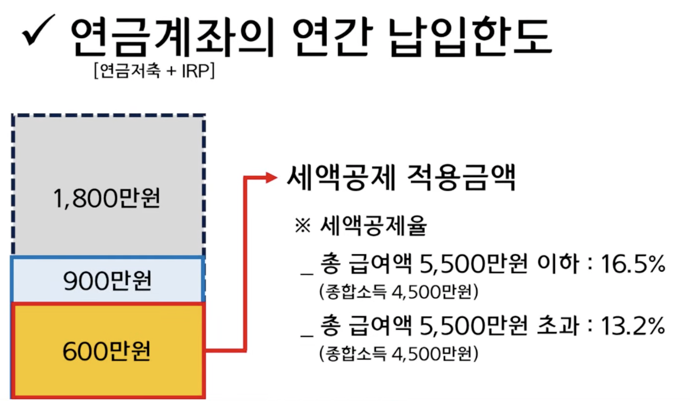
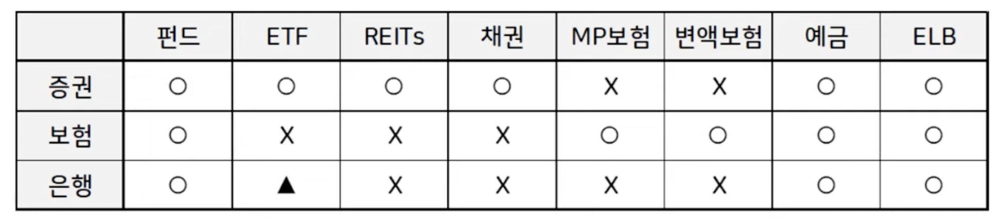
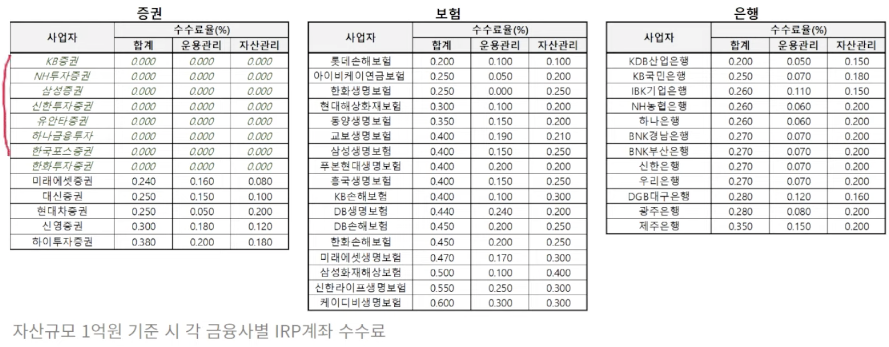
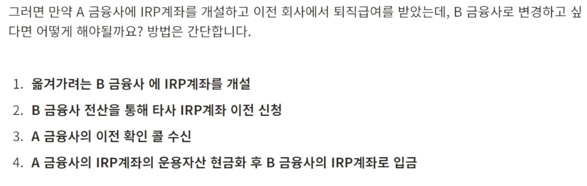
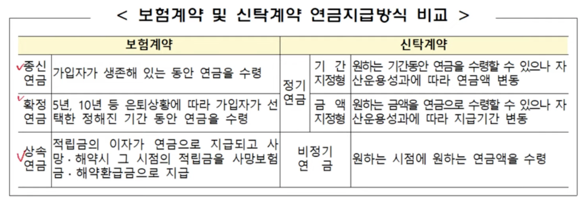

## IRP 에 대한 이해

>    IRP (Indivisual Retirement Pension) 는 말 그대로 개인형 퇴직 연금을 말합니다. 입퇴사가 자유로워진 요즘 세태에 맞게 퇴직금을 쉽게 쓰지 않고 연금으로 활용하도록 강제하는 국가에서 지정한 반 강제적인 연금 시스템

### 종류

* 개인 연금 : 내가 직접 가입 및 투자
  * "퇴직 연금 + 개인 연금" 특징을 가져서 세제혜택을 준다는 것이 특징
* 퇴직 연금 : 회사에서 챙겨주는 연금
* 국민 연금 : 국가에서 챙기는 연금

### 장점

* 퇴직소득세 과세이연
  * 일반 퇴직 소득세 세율이 10% 라면 1억에 1천만원 세금이지만, IRP 는 그대로 유지하기 때문에 해당 금액에 대한 수익 발생 시에 1억원에 대한 이득을 가지므로 **IRP 계좌에 연금으로 유지하는 경우 세금을 떼지 않은 투자 원금을 그대로 투자할 수** 있어 최대한 천천히 받고 해당 금액으로 투자하는 것이 이득
  * 
* 퇴직소득세 감면
  * 퇴직소득세를 이연한다고 해서 없어지지는 않으며, 자금을 인출할 때에 세금을 내게되지만, **연금형태로 받는다고 하면 30% ~ 40% 정도 세금을 깎아주는 혜택**을 줍니다
  * 연금수령기간 1~10년차에 받으면 30% 감면, 11년차 이후에는 40% 감면 해준다

### 특징

* 연금수령한도
  * 연금 수령 가능 첫 해에 다 꺼낼 수 없으며, 연금 수령은 **만 55세 생일이 충족되는 날**이 퇴직급여 수령 가능일입니다
  * ( 현재계좌평가액 / (11 - 연금수령연차) ) X 120%  = 1억 / 10 * 120% = 1,200만원 = 1억 계좌에 1년차는 1200만원 꺼내 쓸 수 있는 셈
* 연금개시
  * 실제 연금을 수령하기 시작한 순간부터가 연차를 계산하기 때문에 **연금수령 조건이 되면, 바로 개시하는 것이 좋다**
  * 55세부터는 해 놓는 것이 좋은 것이 퇴직소득세 감면 차원에서 좋다. 즉, **최대한 빨리 10년을 채우는 것이 향후 퇴직소득세 감면 40% 혜택을 받는 시점이 빨리 오기 때문**이다 
    * 증권사 IRP 계좌의 경우 연금개시 신청하고 **최소 연금조건인 1년에 1만원 수령하도록 신청**하면 된다
  * **IRP 계좌같은 연금계좌는 한번 연금을 개시하면 추가 자금을 납입할 수 없다**는 것을 반드시 기억해야 합니다
  * 이전 직장의 연금계좌에 대해서 개시하는 경우 현재 직장에서는 해당 IRP 계좌에 못 넣고 다른 계좌에 넣어야 합니다
* 연금소득세
  * 연금계좌에서 자산을 운용하면서 발생한 수익에 대한 별도의 소득세를 부과하게 된다
    * 일반계좌에는 이자소득세 15.4% 가 기본으로 붙게 되지만
    * IRP 연금계좌는 **연간 1200만원 한도 (24년 부터, 1500만원) 내의 연금 수령시 5.5~3.3% 연금소득세**를 부과
      * 연령에 따른 연금소득세 : ~70세까지 5.5%, ~80세 까지 4.4%, 80세 이상은 3.3%
      * 참고로 종신보험 등의 종신형으로 변경하는 경우는 무조건 4.4%로 통일된다고 함
    * 연 한도 초과 연금 수령 시에는 16.5% 부과된다
  * 아래의 2가지는 과세대상금액 포함되며 모든 연금계좌의 총 합이 1500을 넘어가면 16.5%이므로 주의해야 합니다
    * 연말정산공제 적용
    * IRP, 연금저축계좌 운용수익
* 종합소득세 세액공제
  * 연금계좌(IRP계좌 + 연금저축계좌)에는 전 금융사 모든 계좌 통틀어 연 최대 1,800만원 금액을 납입할 수 있습니다
  * 여기서 **IRP 계좌에 대해서는 연간 900만원 까지의 금액에 대해서 종합소득세 세액공제를 적용**해줍니다
  * 회사를 다니지 않더라도, 다니더라도 세제혜택을 받을 수 있으므로 잘 활용하면 좋다

* 연금계좌 연간 납입한도
  * 
  * 최대 900만원 채우면 좋지만, IRP 900만원 보다는 **연금 600먼저 채우고 IRP 300 채우는 것이 효과적**이다
    * 수령 시에는 연금저축 계좌가 유리한 부분이 있으므로 연금을 우선시 하자

## IRP 계좌의 운용

### 운용 방안

* 증권사 IRP 경우도 CMA 도 3%는 주지만 예금, 채권 등으로 투자해야 한다
* 은행, 보험, 증권사 모두 활용할 수 있지만, 증권사가 아니면 ETF, 리츠,  채권 투자가 불가능하므로 증권사 추천
  * 
* 다만, 안정적인 노후자산 운용 취지인지 모르지만 큰 투자자산의 경우 최대 70%로 투자 비중이 제한되어 있습니다
  * **최소 30% 이상은 예금, 국고채 혹은 ELB 등의 원금보장에 준하는 안전자산에 투자**해야만 합니다
  * 단, TDF 펀드만으로 자산을 운용하거나 디폴트 옵션을 선택한 경우 별도로 고려할 필요는 없습니다

### IRP계좌의 운용상품

* "예금"은 일반 은행 상품과 금리 차이가 있을 수 있다 
* "펀드"는 이름에 "퇴직연금" 등의 구분자가 포함됨
  * [펀드솔루션](https://www.fundsolution.co.kr/SPSP10000.do?mode=main) 서비스 '로그인 - 지원센터 - 판매사안내' 증권사 별로 취급하고 있는 펀드를 확인할 수 있습니다
* "ETF", "REITs"는 거래소에 상장된 상품을 활용하여 IRP 활용이 가능하나, 펀드처럼 파생상품을 기초자산으로 한 투자는 불가하므로 레버리지 및 인버스 ETF는 이용이 불가능
* "채권"은 장외 채권을 투자자산으로 활용할 수 있는데 일부 증권사(미래에셋, 삼성, 한국투자)의 IRP 만 활용할 수 있다
  * 단, 장외채권은 증권사마다 당일 판매 가능한 수량이 오전에 확정되고, 11~16시 사이에만 매매가 가능합니다

### 디폴트옵션

* 22년 7월 퇴직연금부터 적용되었는데 연금 가입률이 낮아 도입되었고, 저위험으로만 투자하기 때문에 수익률이 낮음
  * 대부분 예금(초저위험), TDF(저위험), EMP 펀드를 혼합하여 구성

## IRP계좌의 활용 TIP

>  IRP 계좌는 금융사에 따라 연 0.0~0.5% 계좌수수료가 있으며, IRP는 1금융사 당 1개가 원칙이나, 연금을 개시하면 추가 개설이 가능합니다

### IRP계좌의 수수료

* [금융감독원](https://www.fss.or.kr/fss/main/main.do?menuNo=200000) - 연금상품비교공시 - 퇴직연금비교공시 - [맞춤형 수수료](https://www.fss.or.kr/fss/lifeplan/fixesCmpr/list.do?menuNo=200967) 에서 확인이 가능합니다
  * 수수료율
  * 
    * 삼성증권 0%, 미래에셋 0.24% - 계좌 잔고에서 빼나간다 다만 수익률의 차이가 나므로 너무 수수료만 볼 필요는 없을 것 같다

### IRP계좌 개설 & 변경

* 여러개 할 수 있지만 관리 차원에서 한 군데에만 하는 것이 좋다
  * 변경
    * 
  * 신규
    * 55세가 넘어 **연금수령 개시를 하게되면 IRP 계좌에서 연금저축계좌로 자금을 이전하는 것이 가능**합니다
      * 그리고 같은 금융사에서 다시 개설이 가능합니다

### IRP계좌의 수령

* 보험사는 보험계약, 증권사는 신탁계약
  * 
    * 특히 **증권사의 신탁계약은 연금 수령 중에도 IRP 계좌 내에서 자금 운용이 가능**합니다
    * 필요에 따라서 **연금 받기 전에 증권사에서 보험사로 이동하는 것도 가능**합니다

## 질문과 답변

* 현재 나의 퇴직금은 얼마인가?
* 해당 퇴직금에 대한 소득세는 얼마인가?

* 미래에셋 vs. 삼성증권 vs. NH투자증권 수수료 및 자기자본 규모는 얼마인가?

### 참고

* [IRP계좌는 주거래은행에서 개설하면 안됩니다](https://www.youtube.com/watch?v=sA3vYCE061E)