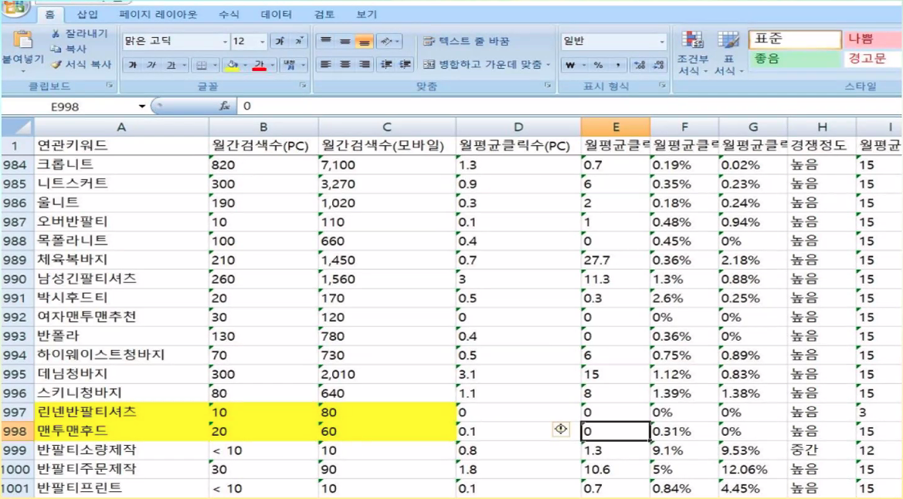
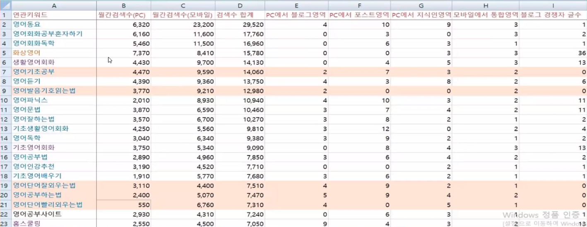

## 유튜브 스터디 그룹 1일차

>     "돈되는 글쓰기" 3일 간 하나. 내 상품에 대한 키워드를 뽑는 것, 둘. 매체 별로 (블로그, 지식인, 카페) 목적에 맞는 글 쓰기, 셋. 스팀잇으로 수익화 하는 방법

### 마케팅의 기본 "키워드 마케팅"

* 플랫폼은 항상 변화하고, 새로운 플랫폼을 계속 따라가면서 살아가야 한다. 결국 본질적인 부분(키워드)을 터치해야 살아남을 수 있다
* 마케팅이란?
  * 켈리 킴 : 성공의 80%는 심리이고, 20%는 기술이다 - 메슬로 나오는 이유가 결국 **사람의 심리를 이해**하는 것
  * "마케팅은 키워드를 모아서 설득하는 것" 이라고 할 수 있다
    * 돈을 쓸만한 사람들을 모은다, 포커스 한다
    * 합리적이지 않은 소비를 한다는 것을 이해해야 한다 - "누가 좋더라" 라는 것을 통해 사는 게 대부분
    * 약장수의 말도 안 되는 말을 하더라도 이성적으로는 이해가 안 되지만, 옆에서 사니까 사는 거다
    * 상대방의 이성을 마비시킨 상태에서 감성으로 설득하는 것이다
  * 제품을 너무나도 잘 만들었지만, 어떻게 사야할 줄을 모르기 때문에 실패하는 경우가 많더라
    * "키워드"는 나의 상품으로 올 수 있는 "길"
    * 어려운 그들만의 단어를 사용하는 것은 세상 사람들은 모른다
* "그러면 어떻게 모아야 할까?"
  * **키워드**로 모아서 **카피**로 설득한다
  * 키워드 활용분야는 "온라인상의 모든 활동에 적용된다"
    * SNS 해시테크는 정확히 그것만 나와서 불편하더라
    * 네이버 노출, 오픈마켓, 소셜커머스

### 키워드 찾는 법

* 시장세분화
  * 타겟의 입장에서 생각하기
    * 모든 대상에 대해 좋다고 하더라도 사람들은 특별한 대상이 되기를 원한다
* 키워드 추출방법
  * 벤치마킹
  * 카테고리 (쇼핑몰) - 팩트/쿠션은 서로 다른 카테고리이므로 나의 상품에 맞는 카테고리가 만족되어야 노출된다
  * 자동 완성어 - 사람들이 자주 검색하는 순서대로 추천되므로, 상위에 자동완성 되는 키워드가 상대적으로 많이 사용하는 단어를 선택하는 것이 좋다
  * 추천 검색어 - 포탈에서 서비스 종료
  * 연관 검색어 - 다른 연관 검색어 상위 몇 개를 활용해서 나의 상품과 비교해서 좋은 점을 표현하되 다른 제품을 까서는 안 된다
  * 네이버 검색광고 - 네이버 가입하고 엑셀파일 다운로드 하면 통계정보를 추출할 수 있다
    * 상품판매의 경우에는 구체적인 단어 '린넨반팔티셔츠' 경우 자주 사용되지 않지만 오랫동안 주문이 들어오는 키워드일 수 있다
    * 
  * 네이버 데이터랩 - 분야별 인기검색어 카테고리 (일/주/월간) 검색어를 찾아서 실시간으로 참고하면 좋다
  * 컬렉션 확인방법 - 사람들이 가장 많이 누르는 종류(상품, 쇼핑몰, 블로그 등)을 상단으로 노출시켜주는 특징
    * 심플목걸이 같은 키워드는 상단에 너무 많은 상품, 쇼핑몰 등이 있어서 블로그에 맞지 않는 키워드

### 키워드를 상위노출 시키는 방법

* 검색량은 관중, **키워드**는 경쟁 
* 키워드가 중요하지, 검색량은 덜 중요하다
  * 경쟁자 글 수가 너무 많다면 '황금키워드'로 너무 경쟁이 심하다는 의미다
  * 
* 실제 경쟁자 글 수가 많아도 대충 쓴 글이나, 복붙해 놓은 블로그가 있으므로 제외하는 팁도 필요하다
* 키워드로 찾아서 실제 검색 결과에 최근 글이 많이 나오는지, 광고가 많은지 찾아서 선별할 수도 있다
  * 통계정보를 통해서 계절 혹은 나이대를 분석하여 키워드 추가할 수도 있겠다

### 작업 시 주의사항

* IP 관리 : 네이버 같은 경우 **wifi 사용 시에 ip 기준으로 block 혹은 등급이 떨어질 수도 있으**므로 유의해야 하고, hotspot 사용하는 경우가 나을 수도 있다. **구글 secret 모드에서 hotspot 사용하는 것**을 추천한다

* 리브라 : 특정 키워드는 포탈이 예약한 키워드이므로, **'맛집' 혹은 '19금' 키워드** 등은 절대 조심해야 하며, 사진의 경우에도 **살색이 많이 들어가는 경우**에 나락을 가는 수도 있으며, 항상 1페이지 였지만, '3페이지 저품질' 과 같이 한참 뒤에 나오거나 '안드로메다 저품질' 과 같이 살아는 있지만 검색에는 나오지 않는 상태가 될 수도 있다
  * 이러한 경우를 대비해서 본캐와 부캐를 만들어서 "빠르게 가는 블로그", "천천히 가는 블로그" 등으로 운영하는 것도 방법이다

* 유사도 : 네이버는 유사 문서 혹은 같은 노래가사가 있는 경우 중복 제거를 하기 때문에 품질이 떨어지면 제외될 수 있다

### 컨텐츠 관련 주의사항

* 신경 써야 할 주요 정보
  * 키워드
  * 사진 : Photoscape 설치
  * C-Rank : 다양한 주제를 기술하는 블로그 보다 전문적인 블로그 글을 노출시켜준다
  * DIA : C-Rank 약점을 보완하기 위한 초심자에 대한 글 자체의 중요도를 참고하여 노출시켜 준다

* 블로그 키워드 배치방법
  * 제목 : 키워드는 다중으로 2개 정도 말 흐름이 깨지면 안 됨 키워드 뒤 조사 X
  * 본문 : 키워드 배치는 능력 껏 (말이 되도록 많이 사용)
  * 정보량이 많을수록 좋다 : 글은 무거울 수록 좋다, 사진은 10장 이상, 동영상도 있으면 좋다
* 글을 읽는 것은 3초
  * 제목에서 문제를 제기했다면 1~2번째 달락에서 답이 나와야 한다
  * 유튜브도 30초 원칙을 지켜야만 한다
* 블로그 최적화
  * 노출 + 검색량 + 체류시간 + 활동성
  * 소통 없이 댓글 달리는 팁
  * 댓글 달 수 밖에 없는 정보

