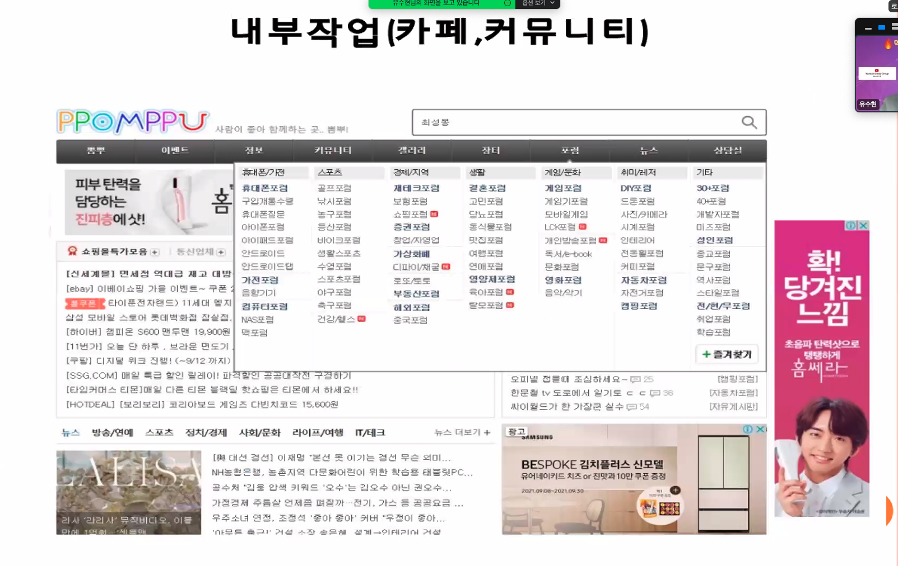

## 마케팅: 바이럴 마케팅이란

>     "돈되는 글쓰기" 2일차. 매체 별로 (블로그, 지식인, 카페) 목적에 맞는 글 쓰기, 온라인마케팅 강사 유수현

### 수익을 높여주는 바이럴 끌어올리기

* 네이버 검색광고 사용 해보기
  * 도메인 키워드 확인이 어려운 경우는 [네이버 검색광고](https://manage.searchad.naver.com/customers/3085497/tool/keyword-planner) 통해서 시소러스 사전 확인 가능함
  * PC가 높다는 것은 좀 핸드폰으로 쓱 쓱 찾지 않는 디테일한 키워드일 가능성이 있다
  * "기타카포" 같이 650 / 3770 3번째 컬렉션 등장은 3700이 다소 높지만 유용한 블로그 키워드이다
* 소통없이 댓글달리는 팁
  * 댓글 달 수 밖에 없는 정보 - 인플루언서 등장으로 소통이 중요해짐
  * 정말 활발하게 블로그를 운영하는 사이트가 있는 댓글에 가서 터뜨리면 !?
    * 이번에 표절했다던데 ? 같은 댓글에 내 블로그 테러가 오지만 로봇은 모른다
  * 궁금하신 사항이 있으면 **댓글로 달아주세요** 등의 표현이 중요하다
  * 비즈 **도안 등을 올리면 다운로드, 퍼가기**를 원하는 요청 댓글이 많이 온다
* 구매 전환의 비밀
  * 타겟의 니즈와 잠재 욕망 + **내 상품의 차별화된 가치**

### 제목을 정할 때 고려요소

* 
  * 상대방과 비교해서, 썸네일을 상대적으로 돋보이게 톤을 높게
  * 관심이 있고 나도 동일한 고민을 해봐야 왜 이 키워드를 썼고, 검색했는지를 이해할 수 있지만 ... 모르겠다면
    * 지식인을 통해서 검색해보면 .. 사람들이 뭘 고민하는 지 알 수도 있다
    * 관련 카페에 가면 고민하는 것들을 찾아낼 수도 있을 것이다
* 
  * 눈으로 읽을 때에 술술 익혀야 하는데, 어미가 달라야 한다. 했다 했다 했다 No
  * "고민 + 해소" 는 너의 얘기가 아니라 나의 얘기로 풀어가야 하며, "끄덕 끄덕" 할 정도로 머릿속에 확실히 있어야 한다
  * 상대방의 의식의 흐름이 꺠지지 않도록 풀어줘야 하고, 이런 것도 고민이 있지 등을 계속 "고민+해소" 반복할 것

### 왜 바이럴이 중요할까?

* 바이럴이 필요한 분야

  * 
    * 클릭 - 행위(설문) - 설치 - 구매 (쿠팡 파트너스 = CPS)

* 사람은 이제 광고가 티가 안나는 진짜 후기를 보려고 한다

  * 
    * 다양한 키워드 조합 - 조금 어색하지만 .. 노출에는 좋을 듯
    * 책 읽어주는 이모 : 책이모 컨셉을 잡아서 바이럴 하는 것이 아주 큰 효과

* 댓글작업을 통한 상위노출 효과

  * 
    * 동시에 많은 댓글이 확 올라야 바이럴 효과가 있으므로 IP 구분 핫스팟 동시에 글 쓰기 
    * 상위노출 하나에 한 달에 100만원 - 계속 상위로 올려주는 역할을 해주기 때문에 3~5천 매출 발생

* 제목에 모든 걸 담아라

  * 
  * 
    * 조회수를 보면 외부작업 (댓글) 통해서 상위노출의 수준이 100배 이상 차이가 난다
    * 이어지는 스토어의 리뷰가 1,500개 이상 달려 있는 기염을 토한다
  * 
    * 이렇게, 중요한 건 등의 전형적인 궁금증을 유발하는 키워드와 표현을 잘 찾아라
  * 
    * 

  * 움짤은 체류시간을 늘려줄 수 있다
  * 

### 상대방의 고민을 파악하라

* **상대방의 고민을 반드시 파악**해야 하고, "돈 내는 것", "말 많이 시키는 것", "이것 놓치면 다음에 못 찾아" 등
* 이러한 부분을 캐치하고 그렇지 않다는 것을 말해주는 것이 상대방을 설득할 수 있다

* 
  * 동일한 사람이 여러개의 모자를 쓰고 마치 초딩처럼 글을 쓸 수도 있어야 한다

### 카페 내부 작업

* 나의 정보는 반드시 가려야만 한다 - 블로그 프로필을 카페 프로필로 변경, 내 블로그 보기 제외한 상태에서 작업 시작
* 가입 하자마자 글을 쓰는 경우 - 가입 하자마자 이런 글만 두개네 .. 와 같이 테러가 올 수 있으므로 조심해야 한다
  * **인사 + 일상 등의 빌드업**이 되고 난 이후에 해야 한다
  * **타겟의 언어**를 분석하고, 자주 쓰는 연습을 하고 익혀야 한다
  * 셀럽들이 마치 엄마인 것처럼 글을 쓰고 행동하며, "이것 사라"라고 하면 다 따라 산다
* 가입된 카페가 180개 정도이고 이를 총알이라 표현한다
  * 전국에 있는 모든 동종 카페를 모두 가입한다
    * 카페 아이디는 30분에 한 번씩 조회수가 업 된다
    * 카페의 지수는 카페 내부에서 활동성을 말하고
    * 나의 아이디 지수는 나의 활동 지수이다
    * 내 아이디 끼리는 접점이 없어야 걸리지 않는다
  * **카페 아이디는 2주 정도만 꾸준히 글 쓰고 사용하면 최적화** 된다
  * 진짜 쎈 키워드도 카페 내에서 잡아낼 수 있다 - **카페 글은 블로그 보다 잘 안 떨어진다**
* 
  * 카페의 멤버는 직원이므로 퇴근시간, 엄마들이 재우고 활동하는 10시 경에 노출시키고 새벽에 지우는 방법도 있다
  * 쿠팡에 잘 팔리는 물건 키워드 활용해서 활용할 수도 있다
  * 핫딜 올려주는 글 하나 올려주는데 3.5만원 받기도 하고, 업체로 가면 5만원도 받음 - 15개 50만원 - 200 구매 발생
    * 조회수가 6000이면 1~2% 전환율이 나오므로 약 10~15개 판매된다
* 유명한 맘 카페
  * 맘스홀릭 (우아함), 레몬테라스 (공격적)

### 인스타그램, 페이스북

* 
  * 누군가 멀리 있는 사람을 소환하는 느낌으로 댓글 작업을 한다
  * 이걸 혼자서 다한다고 ... 어마 어마 하구만

* 
  * 내가 이 카페이 동화되어 글을 작성하고 작업해야 한다 
  * 카페에 하루에 2~30개 가입하고, 작업하되 짤려도 멘탈을 잘 부여잡아야 한다
* 

### 바이럴 마케팅

* 
  * 내 정보는 모두 가려야 한다 숨어라 !
  * 네이버에 노출 안되게 체크해야 걸리지 않는다
  * 프로필 다 다르게 구성하고, 가릴 걸 다 가려라
  * 카페는 약 200개 정도는 가입해야 한다

* "김치 찌개 끓이는 방법" 목적에 따라 글 쓰는 이해를 다르게 해야한다 
  * 빨리 끓이기를 원하는 사람과
  * 맛있게 끓이기를 원하는 사람 

### 과제

* 어떤 상품을 갖다놔도 팔 수 있어야 한다
  * 타깃은 똑같지만, 상품에 따라서 이렇게 설명하고 저렇게 설명할 수 있어야 한다는 말이다
  * 하루 종일 해당 주제에 대해서 지속적으로 상대방을 분석하고, 어떤 카피를 쓰면 좋을 지를 고민한다

* 과제1_ 내가 화장품을 <u>모든 피부가 사용가능한 제품</u>을 만들었을 때 카피
  * 
* 과제2_ 화장품을 <u>티존과 유존에 따로 바르는 화장품</u>을 만들었을 때 카피
  * 