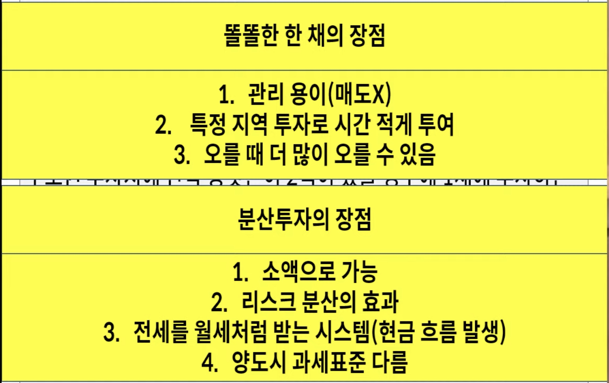
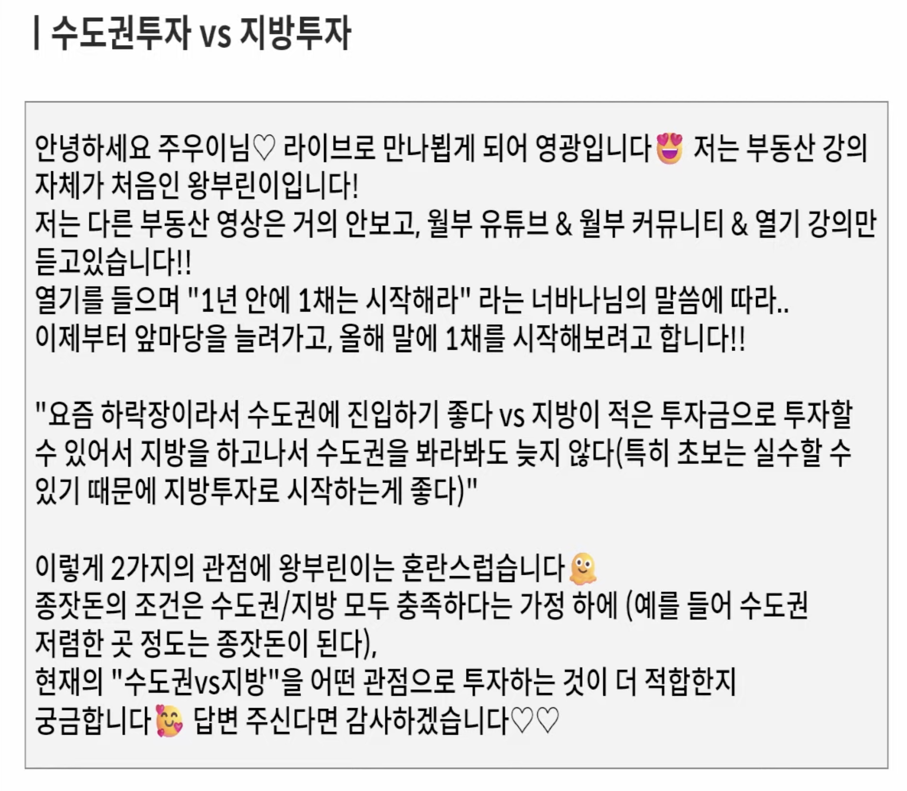
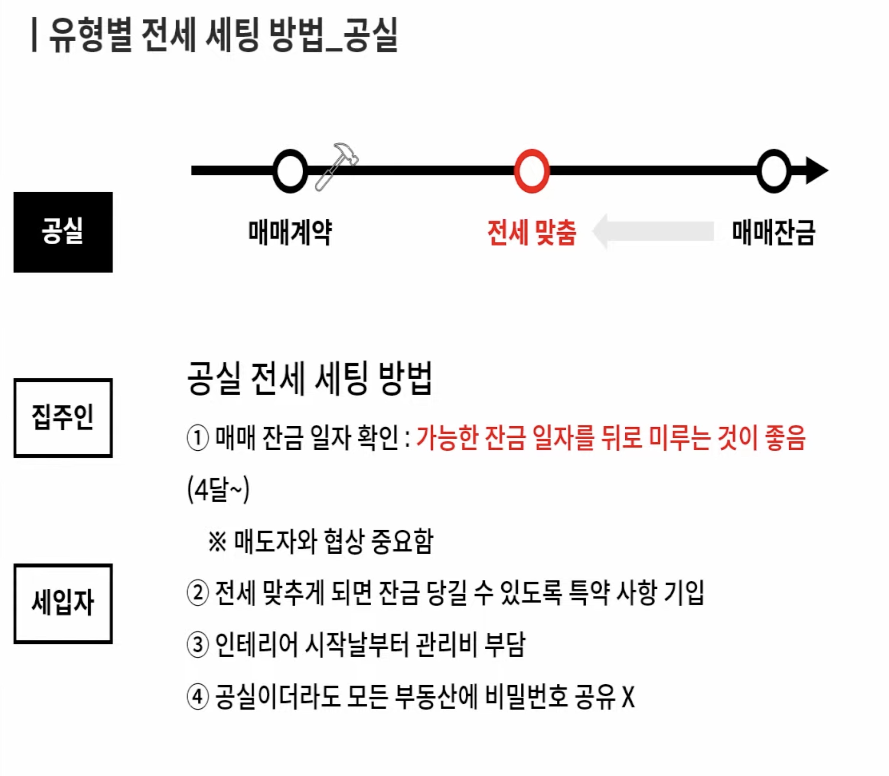
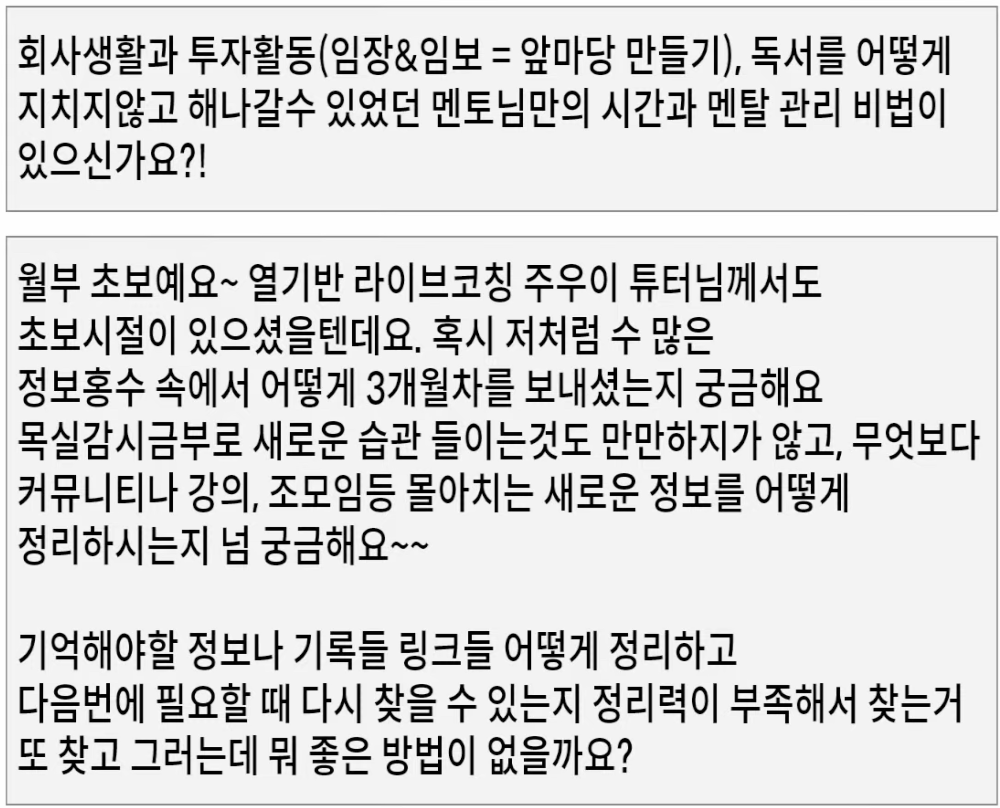

## 루틴: 2024년 3월 28일 (목)

>     [부동산 투자자로 부자되는 법](https://www.youtube.com/watch?v=ct3cywlYSGQ)

### 오늘의 작업 이력

#### 이력

* 19:10 ~ 20:00 강의 시청

### 꼭 알아야 하는 Q&A

#### 강의 목적

* 알고 있는 것과 모르고 있는 것 확인
* 알고 있는 것을 행동으로 옮기기
* 시장에서 끝까지 살아남기

#### 역대 최다 질문

1. 내집마련 vs. 투자

   * 진짜 부자가 되고싶다면 내집마련 보다 투자가 되어야 하고, 내집마련 했다고 하더라도 결국 0호기가 될 가능성이 높을 것입니다
   * 

   * 투자 먼저 해야 하는 분들은 거주 안정성 보다 자산, 현금흐름 혹은 자금이 부족하여 돈을 먼저 불려야 하는 사람
   * 내집 마련의 경우 거주 안정성이 너무 중요하거나, 내 집마련을 하고도 투자가 가능하신 분들
   * "실거주"의 경우 저평가 + 입지를 고려하는 것이 중요하지만, "투자"는 저평가 뿐만 아니라 타이밍이 너무 중요합니다
     * 거래량은 늘지 않았고, 매매가격도 지지부진 하고 있다, **전세가격이 올라가는 순간이 정말 기회**다
     * 

2. 1주택자 분들이 해야 할 행동

   * 선택을 할 때에는 장점과 단점을 잘 고려해서 선택하세요
   * 
   * 1주택자 or 실거주 매수 후 투자 방법
     * "지금은 <u>종잣돈을 모아야</u> 하는 시기" 대출금 상환 후 저축이 되어야 하고 **연간 저축액이 3천만원이 되어야 한**다. 즉 대출금이 충분히 작고 갚으면서 저축이 되어야 한다
     * "<u>갈아타기</u> 할 좋은 시기" 현재 상황에서 자가를 매도하고 상급지로 갈아탈 수 있는데, **반드시 매도 후, 매수를 해야** 한다. 즉, 지금처럼 시장이 안 좋은 시기에는 매수를 위한 계약금을 날리거나 매도하려고 했던 물건을 초급매로 팔아야 하는 상황이 발생한다. 반대로 상승장에서는 반대로 일단 사야할 집을 저렴한 가격에 잡고, 매도하는 것이 올바른 순서이다
     * "<u>자산 재배치</u> 할 좋은 시기" 이긴 하지만 내 투자 실력이 충분히 쌓이고 진행하고, 실력이 쌓일 때까지 종잣돈 모아서 투자를 해야 합니다. 즉, 내가 손해보지 않는 투자를 할 수 있는 능력치가 쌓인 이후에나 재배치가 가능한 시점입니다
     * 
       * 갈아타는 가장 쉬운 공식은 **평형을 줄여서라도 상급지로 가는 선택이 더 좋다**
     * 
       * <u>양도차익이 큰 주택을 소유</u>하고 있다면 **비과세를 받을 수 있도록 준비해야 합**니다. 즉 중간에 매도를 한 번 하는 것이 좋다는 의미
       * 
         * 즉, 한 번 팔고 사고 하는 과정에서 털고 갈 수 있는 기회가 될 수 있다
   * "호재"에 매도와 매수는 금물
   * 
     * 높은 가격에 샀는데 "**내가 가진 자산이 싼지 비싼지**"를 아는 것이 가장 중요합니다
     * "반응 보다 대응을 하세요" 가격이 적절하고 중심지라면 버티고, 싸거나 외곽이라면 갈아탈 것을 노려야 한다
       * 

3. 똘똘한 한채 vs. 분산투자

   * 
     * 지금은 전체적으로 가격이 내려갔으므로 저렴한 가격에 조금은 큰 집을 사는 것이 좋을 수 있다. 내가 경험을 쌓고 싶고, 더 많은 물건을 찾고자 한다면 당연히 소액투자를 하는 것도 방법이다. 내가 **3~4억이 있다면 수도권 상급지만 바라봐**야 한다
       * 

4. 수도권투자 vs. 지방투자

   * 
     * 똑같은 돈으로 가치 있는 물건을 살 수 있는 시장이 아니기 때문에 소액이라면 지방을 선택할 수 밖에 없을 것이고, **어느 정도 돈이 있다면 무조건 수도권에 투자하는 것이 가장 현명한 시기** 입니다.
       * 
         * 
       * **지역별 흐름에 따른 공급의 차이**
         * 금리와 같은 경우는 전체적으로 떨어지는 경우는 예외적이나, 큰 틀에서는 이러한 사이클이 있는데 수도권은 약 10년, 지방은 5년인데, 수도권은 좋은 상승 효과가 강남에서 인천, 강북 까지 퍼지는 데에 약 1년 반에서 3년까지도 소요될 수 있습니다. (공급부터 입주까지 3년) 즉, **서울에는 공급이 없지만 인천은 공급이 유지되는 경우가 있어서 서로 영향을 주게 되어 전세가가 매매가를 당기**는 효과가 있다.
         * 지방의 경우 울산의 예를 들면 동구, 중구, 남구가 공급에 따른 사이클이 거의 유사하게 동작하여, 거의 동시에 전세가와 매매가가 같이 움직이는 효과
       * "**매매/전세가의 차이**"
         * 지방은 매전차가 거의 없기 때문에 거의 따라가지만, 수도권은 매전차이가 크지 않기 떄문에 그 차이를 극복할 때 까지 기다려야만 사이클이 길어진다 
       * "현재는 위기이지만 **기회가 있는 곳을 찾는 것이 중요**합니다"
         * 신축 아파트이지만 주변에 전세가 싹 사라지면서 전세가가 올라가면서 결국 매매가를 밀어올리는 시점인 아파트가 있다
         * 현재도 네이버 부동산에 좋은 아파트가 많았다
       * "비슷한 조건이라면 수도권을 잡지만, 조건이 다르다면 더 좋은 투자를 고민하세요"
         * 정말 좋은 조건인 것이 가장 중요하다

5. 좋은 것을 먼저 보는 이유

   * 
     * 투자금 보다 더 중요한 것은 어떤 매물인지가 더 중요하다 - 가격이나 매전차가 중요한 것이 아니다
       * 

6. 기회를 잡는 방법

   * 
     * 내가 잔금할 수 없다면 전세를 끼고 하는 것이 좋지만, 이것 이전에 "**가치 대비 싼 집인지**" 여부를 알아볼 수 있어야 한다
     * 
       * 앞 마당이 아닌 경우 2달이 기회가 주어졌지만, 확신이 없어 투자할 수 없었고, 앞마당을 만들려는 상황에 이미 올라버렸다 (평촌)
       * 결국 **앞마당을 최대한 많이 만들고 계속 예의주시하고 지켜봐**야 한다

   * 시스템 투자의 현실판
     * 
       * 
         * 매매값이 주춤하는지, 전세가가 올라가는지를 잘 지켜봐야만 한다
   * 현실적으로 1년에 한채씩 가능한가요?
     * 
       * 최소 2~3년을 바라보고 **소액 투자를 할 수 있도록 역전세를 내지 않도록 시스템을 만드는게 핵심**
       * 
         * 지금도 지역 투자 가능한 곳이 충분히 있다
           * 
   * 지금이 기회인가?
     * 
       * 9년 동안 투자를 해왔고, 투자를 할 수 있는 물건은 계속 있었다. "물 들어오고 노저어야 할 시점" 보다 노를 저을 수 있는 능력을 최대한 기르는 것이 가장 중요합니다
         * 
     * 
       * **절대적 저평가 내에서 상대적 저평가 아파트를 찾**는 것
         * 
           * 전세가율이 50% 정도까지 다가갈 때에 싸지는 것이다
         * 
           * 현재는 14~15정도인데, 2018년 시장이 저렴한 시기가 PIR 12 정도이다
           * 지금은 **절대적 저평가는 아니지만, 점점 다가가는 시기**이다
         * 
           * 주택구입부담지수 - 네이버 - house-state 검색 - 얼마나 부담을 가지는 정도를 나타내는 참고 지수
           * 소득, 금리, 집값 에 따른 변화 - 아 .. **현재는 여전히 좀 부담을 가지고 있는 시기**이구나
     * 
       * 
     * 
       * 입지가 우월하기 때문에 입지를 선택해야 합니다
     * 
       * 입지이고 신축이라서 ... 
     * 
       * 시간이 흐름에 따라서 
     * 
       * 입지가 거의 비슷한 경우라면 ... 신축도 좋지만 ... 10년이 흐른다면 입지가 중요해진다

7. 시험 시간

   * 금리가 바닥의 신호가 항상 일치하지는 않는다
     * 
     * 
       * **분양 물량이 줄어들고, 거래량이 줄어드는** 경우 국가도 거래량을 늘리기 위한 다양한 노력을 시도한다
       * 
         * **지금 현상이 미분양이 줄어들고 있는지**, 바닥을 다지는 지 여부를 확인할 수 있다
     * 
     * 지금은 어렵다 ... 또 기회는 올 수도 있다. 입지 (직장, 교통, 학군, 환경) 모두 좋으면 좋겠지만 ... 더 중요한 것은 "**저환수원리**" 입니다
       * 

8. 임장하는 방법

   * 
     * 대장아파트를 가는 게 좋겠지만 모든 곳을 다 봐야 한다
   * 
     * 분위기 임장 : 어떤 사람이 살고, 내가 산다면 어디에 살면 좋을지, 아이들은 많은지, 저녁에 가로등이 켜져 있는지 등 **거주하기 편한 환경인가를 확인**하는 것. 돈에 구애를 받지 않는다면 어디에 투자를 할 지를 결정할 수 있다
     * 선호학교 등에 대해 전화로 물어보고 친절하게 답변해 주는 부동산에 예약하고, 방문하여 현장 매물을 확인한다
     * 

9. 매수 결정 전 꼭 해야할 행동

   * 
     * 
       * A 지역과 B 지역이 있다면 결국 내가 살 것은 단지 내에서 **가장 좋은 물건**을 사야 하는데 ... 양쪽에 전화를 합니다. 
         * A에는 10시에 **예약을 하고 물건을 보여달라고** 하고 매물의 "상태, 가격 및 협상" 을 기억합니다
           * 그리고 다른 부동산에 예약을 하지 않고 보여달라고 하고 계속 인근 부동산을 다 가보면서 장부물건 등을 봅니다
           * 다른 부동산의 물건이 괜찮다고 한다면 19시 정도에 예약을 해 놓고 보여달라고 합니다
         * B에는 14시에 매물을 보기로 예약하고 A 에서 했던 물건과 비슷하게 반복합니다
       * 이러한 방식으로 부동산을 털게 됩니다. 어떻게 하면 부동산 문을 열 수 있을까?
         * 음료수를 사거거나, 과자, 귤 등의 선물공세를 하거나 나름대로 부동산 사장님과 친해져야만 한다
         * 반드시 매수 전에 부동산을 털어야 합니다. 단 돈 100만원이라도 털 수 있다면 개꿀 !!!
       * 모든 **인근 부동산을 다 털어서 확신이 들 때까지 계속 돌고 반복**해야만 합니다

10. 우리가 알아야 하는 세금

    * 
      * 
    * 
      * **취득세 보다 더 높은 수익률을 낼 수 있는 능력을 기르는 것**이 가장 중요하다
      * 종부세는 부부 공동명의를 하게되면 9억 + 9억인 경우 (증가해서) 세금이 나오지 않는다
      * 돈 많이 벌고 많이 내는 것이 이득이다 (결국 좋은 집을 사는 것이 첫 번째이다)
    * 
      * 양도차액이 큰 경우 공동명의, 가액이 작은 경우 개별 명의가 더 유리하다
        * 
    * 

11. 모을 수 있는 금액이 적은 경우

    * 
      * 더더욱 신중해야 하며, 더 발품을 많이 팔고, 더 많은 물건을 보고 결정해야 합니다
      * 지방은 공급이 있다가 없어지는 곳, 수도권은 둔촌주공에서 1.2만 세대 경우 전월세가 그만큼 발생하게 된다 생각보다 많이 발생하며 전세금이 많이 빠지게 되고, 매매가도 빠지게 된다 
        * 하지만 이와 관계 없는 곳은 전세가가 올라가게 될 것이다
        * 

12. 월부인의 청약 이용법

    * 
      * 
    * 
      * 
        * 분상제 지역에 투자를 해도 되는 사람은 가점이 70점 언저리는 당점 굿
    * 
      * 매매가도 좋지만 전세가도 올라가며, **좋은 지역일수록 공급이 빨리 해소**될겁니다
        * 헬리오시티 같은 경우 1년만에 모두 해소되더라 전세금액이 빨리 올라가는 경우 
        * 
        * 
          * 둔촌주공 입주시에 전세가 떨어질 것이다 ... 7억이면 정말 싼 전세다 (5억대 까지도 떨어지겠지만...) 이후에 버티기만 한다면 더 높이 올라갈 수도 있겠다
          * 

13. 투자 시 매수하는 과정

    * 
      * 
        * 
      * 
      * 

14. 구축을 볼 때

    * 
      * 오래된 건물은 용적률이 충분히 높아야 좋은 땅 가치를 가지기 때문에 **최소 210 ~ 230% 보다는 낮아야 좋**다
      * 

15. 리모델리을 바라보는 관점

    * 
      * 리모델 비용을 감수하더라도 가치가 좋다고 생각하니까 인기가 있었는데, 지금은 리모델 비용이 상당히 올랐기 때문에 그 보다 더 큰 수익을 얻을 수 없다고 판단되는 경우가 아니라면 리모델을 하지 않을 것이므로 상승장인 경우에 리모델이 효과적이다 
      * 
      * 

16. 자산재배치 시기

    * 
      * 

17. 원씽의 의미

    * 
      * 
    * 

18. 매매가와 전세가가 계속 떨어지는 시장

    * 
      * 매매가 떨어져도 괜찮아요 .. **전세가만 올라가면 문제가 없습**니다.. 결국 "**공급과 수요**"를 잘 바라봐야 합니다
      * 
      * 전세가가 2 % 올라간 경우는 많아도 -2% 내려간 경우는 2번 밖에 없었습니다 
        * 98 외환위기
        * 2005 카드사태
        * 2008 금융위기
        * 2019 공급이 많아서 역전세
        * 2022 공급, 금리 상승, 임대 3법 올라가 역전세
      * 
        * 
        * 한 번 내려가면 다시 올라갈 수 밖에 없다 .. 다시 전세가가 올라갈 가능성이 높다 (금리가 올라가면 더욱 더)
          * 언젠가는 역전세 한 번은 올 수 밖에 없다 "**비오면 우산을 쓸 수 있도록, 리스크 관리**" 를 잘하라

19. 은퇴를 앞 둔 분들의 투자 방법

    * 
      * 결국 "독강임투" 밖에 없지만 ... 다 주택자로 가는 것은 조심하셔야 합니다. 왜냐하면 매도도 일 년에 한 채이므로 팔기가 어려울 수 있으므로 적절한 수의 매수하세요
        * 좋은 집 하나를 마련하고, 주택연금으로 전환하는 것이 좋다 (주택가격이 높은 시점의 영향이 크다)
    * 
      * 1호기와 2호기까지는 일단 매수합니다. (5/3, 2억 들여서 2채를 샀습니다)
      * 26년도에 전세는 어느 정도 오를 수 있는데 5% 올린다면 (5억/3억 1500 x 2 채)
      * 28년도에는 전세도 5억이 되었다고 가정한다면 ... 2억을 올려받을 수 있는데 총 +4 억을 올려받을 수 있지만 2번째 집을 올리지 않고 월세로 바꿉니다. (**1억에 월세로 바꿔서 나머지 한 집을 월급으로 바꾸면 된다**)
      * 보증금 1억에 160만원 월세를 만드는 방법이 좋습니다

20. 휴직 vs. 종잣돈

    * 
      * 
      * 
    * 당시에 **2천만원이 모자라서 분당을 투자하지 못하고 수지를 투자할 수 밖에 없**었다

21. 시간, 정보 & 멘탈 관리

    * 
      * 

22. 시간 관리 방법

    * 
      * 업무 1 이 더 중요한 일
        * 

23. 가족과의 관계

    * 
      * 

24. 목표를 달성하는 방법

    * 
      * 1년차 : 독서, 강의, 임장
      * 2년차 : 투자
      * 3년차 : 독강임투를 포기하지 않고 반복할 수 있는 힘
      * 
      * 나는 언제 행복감을 느끼는가?

25. 마무리

    * 

    * 

#### 용어 정리

1. "자산재배치" 란?
   * 내가 6억(전세 3억) 집을 갖고 있는데 전세가가 4~5억이라고 하면, 부채가 없다면 갑자기 돈이 생길 수 있기 때문에 이 돈을 이용해서 재투자하는 것을 말합니다
2. "물건털기"란?
   1. 진짜 좋은 물건을 찾았다고 생각이 들었을 때에 조금이라도 더 좋은 물건을 찾는 과정 (100만원이라도 싸거나, 깎을 수 있는 단계)

#### 액션 아이템

* **앞마당 10 개, 매수는 2024년 11 월 전에 매수**할 것이다
* 둔촌 주공 물량에 따른 영향, 그리고 어떻게 기회를 얻을 것인가?
* 평촌의 향후 리모델링 이슈가 다시 커진다면 ... 또 풍덕천동 처럼 오를 수도 있지 않을까?
* **전세 2채에서 월세 1차로 전환**하는 것이 인생으 ㅣ목표
* **책 한 권에서 벤치마킹 1개씩만 온전하게 루틴으로 만드는 것**이 핵심 - 이후에 계속 반복 학습
* **루틴을 만들고 일주일을 한 번이라도 제대로 지켜보는** 것