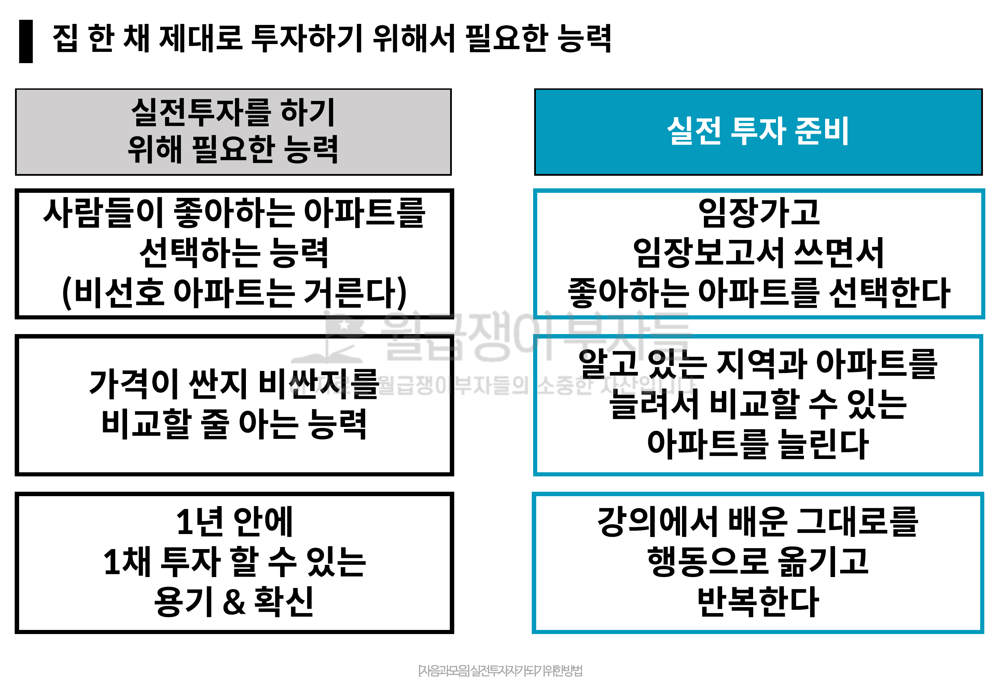

## 루틴: 2024년 4월 5일 (금)

>      왜 앞마당이 필요한 지에 대해 학습합니다.

### 오늘의 작업 이력

#### 이력

* 19:40 ~ 21:00 강의 시청

## 투자를 할 때 가장 중요한 것

### 1. 투자의 첫 걸음

#### 1.1 투자에서 가장 중요한 것

* 내가 잘 아는 영역(지역, 단지)만 투자할
* 가치가 있으면서 싼/적당한/비싼 물건을 구별할 수 있어야 하고, 적당한 가격(20% 하락)이면 투자하라
* 투자에 대한 확신이 있어야 하고, 매수를 했다면 가치를 찾아나갈 때 까지 기다려라

> 모르는데 투자하지 않으며, 투자하는 데 **필요한 노력을 들임으로써 확신**을 가질 수 있다

#### 1.2 제대로 투자하기 위해서 필요한 점

* 이 아파트 담보대출해서 살고싶은가?
* 사람들이 좋아하는 아파트 고르기
  * 투자 범위를 보수적으로 보아야 한다. 싸기만 한 집은 아무도 선호하지 않는다
  * 도봉구, 금천구 같은 4급지 이하는 버리고
  * 성동구, 금호동
  * 서울 : 서대문, 동대문이 마지노선
  * 경기도 : 광명, 수지, 분당, 평촌 까지만 보세요

* 가격이 싼지 비싼지 비교할 줄 아는 능력
  * 열심히 봐라, 내가 아는 단지가 얼마나 인가?
* 1년 안에 1채 투자할 수 있는 용기 & 확신

#### 1.3 실전 투자 준비

* 
* 임장 보고서 쓸 때
  * 이 동네에서 살고 싶어하는 아파트는?
  * 실거주 신혼부부라면 어디서 살고 싶어할까?
  * 그 거주지에서 사는 사람의 임장을 이해하라
  * 어디에서 살고 싶은지를 질문을 하면서 임장을 하라
* 알고 있는 지역과 아파트를 늘려라
  * 몇 백개씩 봐야 하는데 ... 
  * 지역에서 사람들이 좋아하는 동네에 있는 아파트는 적어도 알아야 한다
  * **성동구 옥수동** 아파트 vs. **금호동** 아파트는 사람들이 좋아한다
  * 안양 **동안구 구축**, **평촌 범계역** 아파트는 잘 살펴봐야 한다
* 강의에서 배운 그대로 행동으로 옮기고 반복하라

##### "**같은 가격이면 어느 지역, 어느 단지를 투자하는게 좋을지** 배워간다"

* 8억 초반, 8억 후반 이런식으로 가격대를 구분하라
* 공급량은 정해져 있으므로 파악하여 

#### 액션 아이템

* 아침에 일어나서 "나도 할 수 있다" 라고 말하는 습관
* 중요한 것과 중요하지 않는 것에 대해 완급을 조정하면서 설명하는 것이 강의에서 중요하구나

