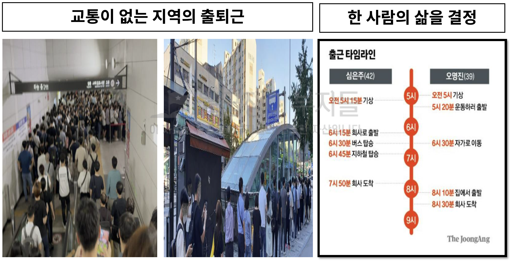
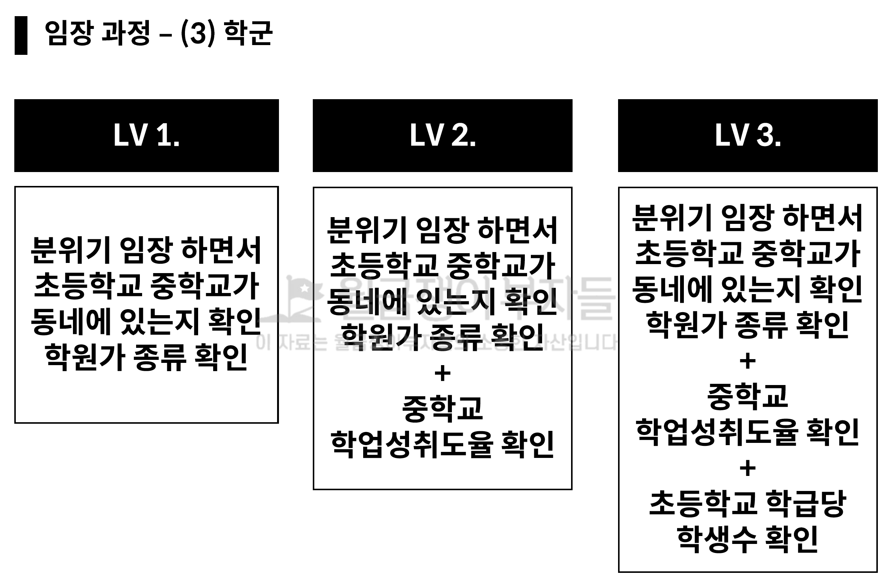
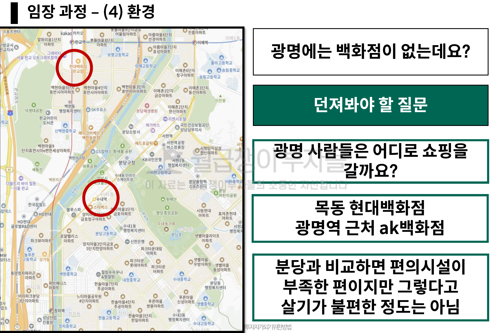
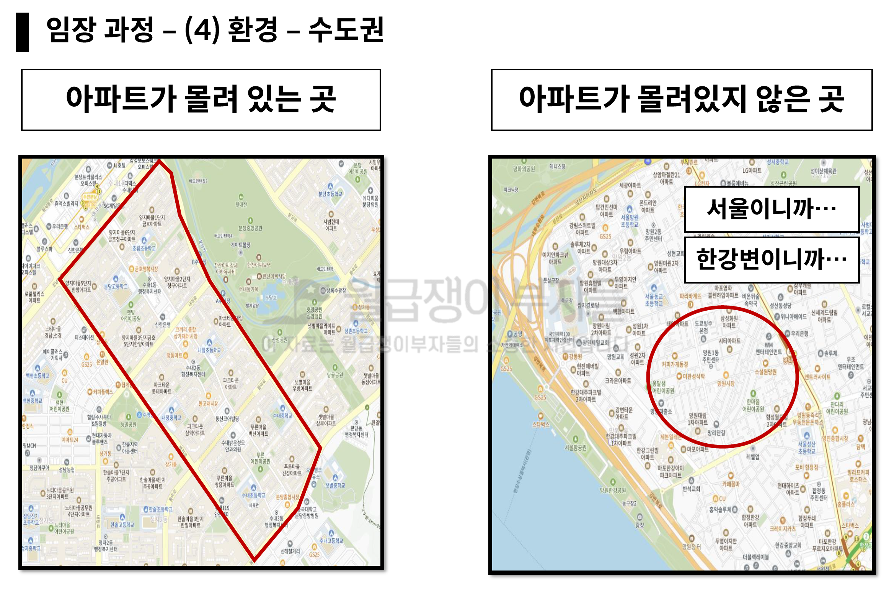
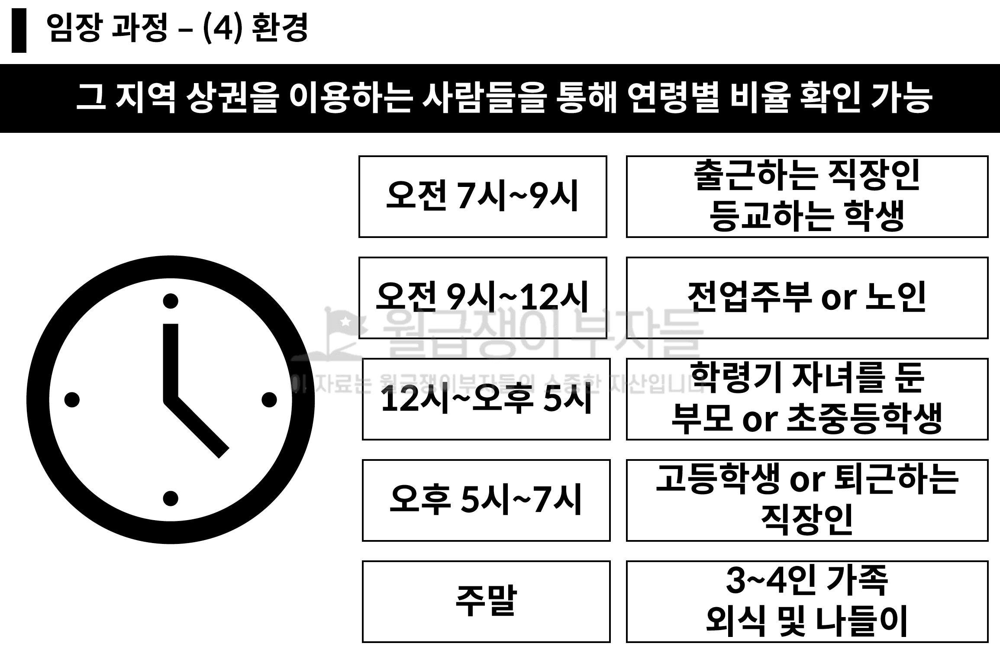
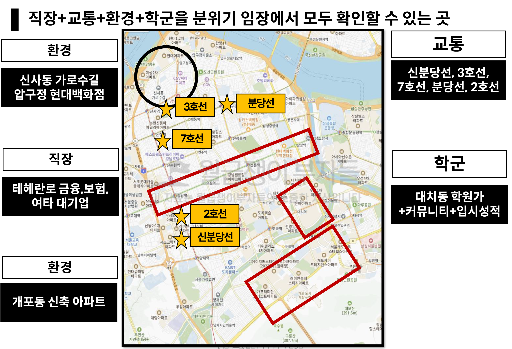
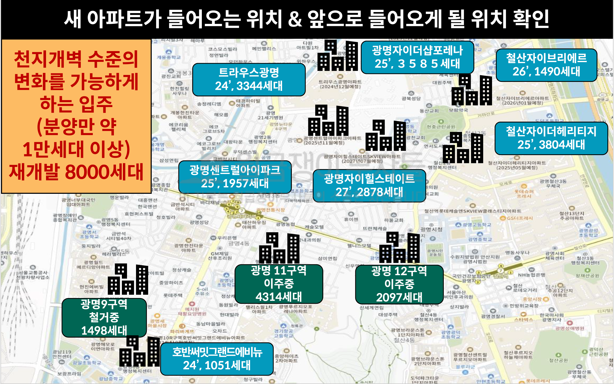
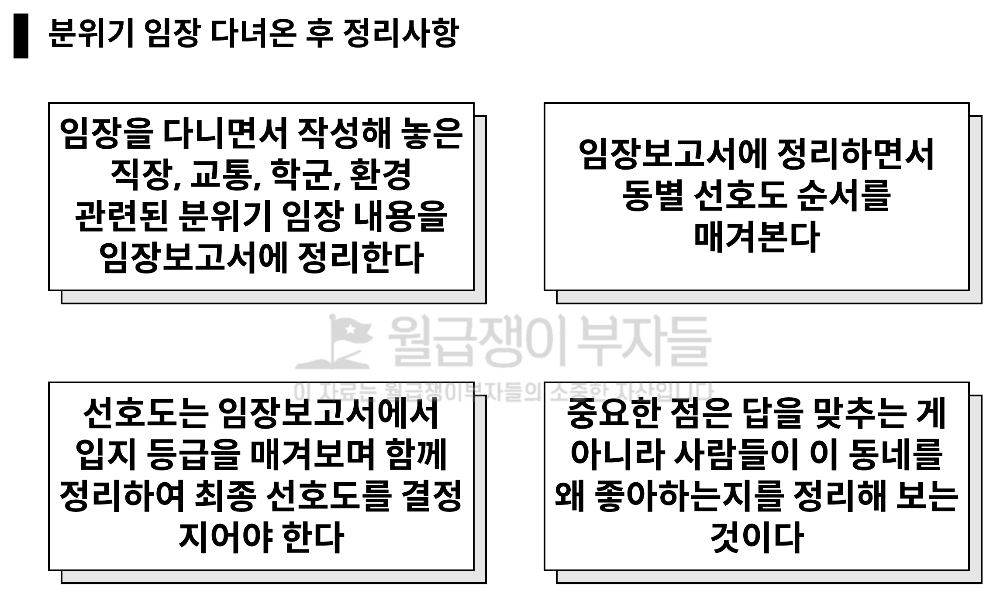
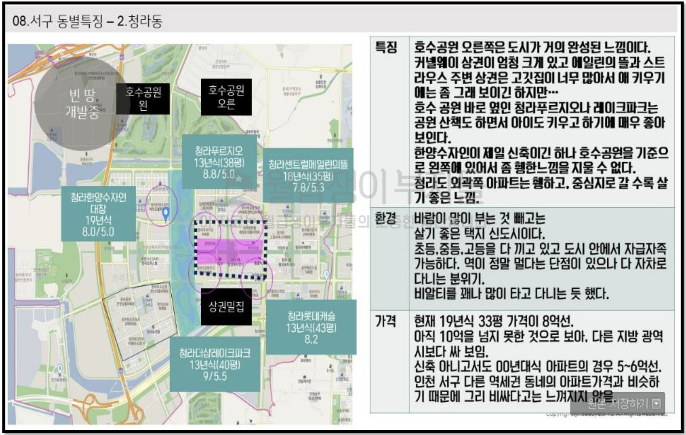
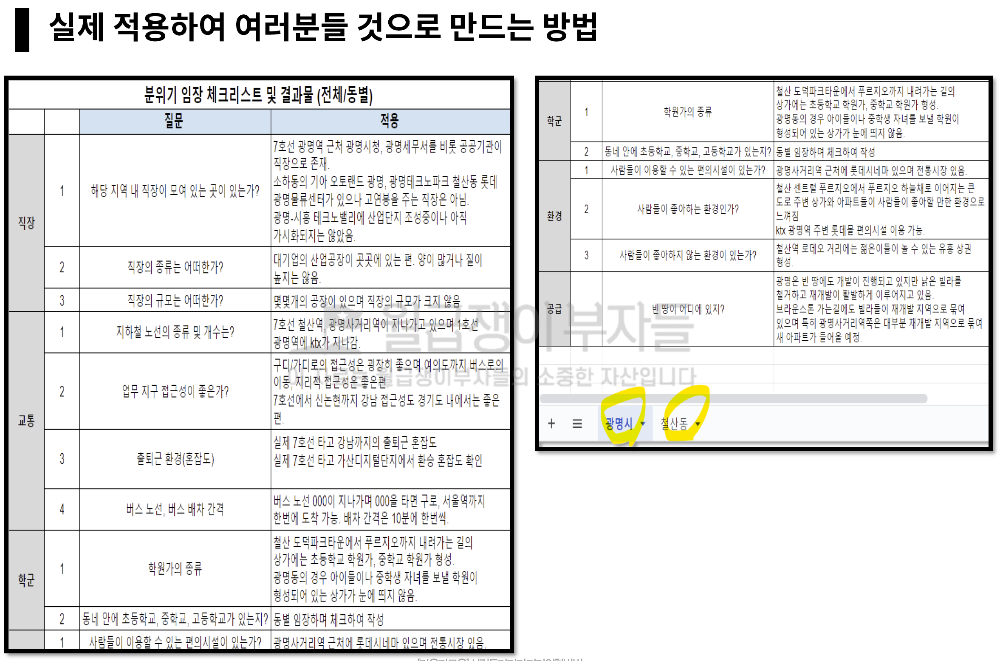

## 루틴: 2024년 4월 8일 (월)

>      왜 앞마당이 필요한 지에 대해 학습합니다.

### 오늘의 작업 이력

#### 이력

* 16:00 ~ 20:00 강의 시청

## 현장에서 절대 헤매지 않는 현장 공략법

### 1. 임장 과정

#### 1.1 직장

* **규모와 종류에 따른 직장** 임장 분석
  * 강남의 경우 금융, 보험은 돈 많이 주겠네
  * 판교에는 어떤 기업들이 있는지 등 종류 이해
  * 수원 영통에 삼성 밖에 없는데 이 정도 연봉이라면 이 지역의 어디에 살까? 어디를 좋아할까?
  * 안양의 경우 소규모 기업, 공장 및 지식단지 센터가 규모도 작고 질도 작지 않겠구나 .. 직장으로써의 수요가 있을까?
  * 수원 삼성에서 걸어서 20분 이상 다닐까? 버스나 자차를 타겠지 ...

#### 1.2 교통

* 교통이 없는 지역의 출퇴근은 실제로 체험해봐야 **업무지구 접근성**을 사람들이 왜 선택하는 이유를 알 수 있다
  * 카페 체험을 통해서 교육, 가정, 소비 등에 따른 분위기를 파악할 수 있다
* **업무지구로 들어가는 노선이 얼마나 다양한** 것인지가 중요하다
  * 아파트가 많은 동네에서 강남으로 가는 버스 노선이 있는가?
  * 주말에 교통 직업 임장이 어려운 경우 지하철, 버스 노선도 기준으로 확인하라

#### 1.3 학군

* 아실 학업성취도 + 학급당 학생수
  * 초등학교 학급당 학생수가 너무 작으면 (10~20명) 좋지 않은 환경이다

* **자모님의 임장 공식**
  * 직장을 보면 **종류와 규모**를 확인해 보세요
  * 교통의 경우 **출퇴근 시간**을 확인해 보세요
  * 학교를 발견하면 **학원가**가 있는지 확인해보세요
  * 상권을 만나면 **학원가 다양한 종류**가 있는지 **유해시설이 없는지** 확인해 보세요

* 판교와 수내의 현대백화점은 급이 다르다

* 유흥이 등장할 수록 가치는 떨어지지만 투자를 하지말라는 것은 아니며, 나의 예산 내에서 우선순위를 정하는 것이 필요하다

* 브라운스톤, 도덕파크타운 지역의 학원 상가가 있어 좋은 거주지로써의 가치를 가진다
* 하한동에서 주공단지 아파트는 임대료가 싸다는 마링고, 결국 소비력이 떨어질 수 있다는 것을 인지하고 볼 수 있어야 한다
  * 과거에는 먹어줬지만 철산동이 뜨면서 지금은 많이 죽었다
  * 광명 SK 쪽은 제조업 위주라 종사자 수요가 많지 않은 것을 알 수 있다
* 결국 광명은 철산부터 보면 된다

* 분당과 같이 아파트 + 아파트 는 너무 좋아 "결국 서울, 마포, 한강뷰 나홀로" 대비 분당 환경 좋은 아파트가 더 짱이더라
  * 결국 아무리 입지가 좋아도, 망원동 빌라 촌에서 아파트 몇 몇 개가 박혀있는 곳은 

* 모든 것을 갖춘 곳이 강남이므로 모든 지역에 대한 비교 대상이 될 수도 있다
* 분위기 임장의 핵심인 "땅의 가치"를 "직장-교통-학군-환경"을 확인하는 것이 가장 중요한 방법입니다

#### 1.5 공급

* 84가 9억이면 정말 싼데, 84가 12억인 아파트가 있는데 너무 어렵다, 강동구 올림픽파크포레 옆 더샵둔촌이 84가 13억인데
  * 광명을 알아가면서 서울과 비교할 수 있는 능력을 키울 수 있다
* 전세가 몇 개가 나오고, 전세 범위가 얼마인지, 철산동 가격까지 볼 수 있다면 투자에 좋은 학습이 될 것이다
  * 물론 전세가가 낮이지므로 투자가 어려울 수 있기 떄문에 2025~2026년까지 지켜본다면 좋은 기회가 될 수 있다

* "이 동네를 왜 좋아하는 지" 꼭 써볼 것

* 가장 중요한 **행동 단계를 하나씩 제대로 밟아 가는 것이 학습**의 핵심이다

#### 액션 아이템

* 2025~2026년 까지를 멀리 보고 광명은 반드시 공부해야 하며, 철산동이 핵심일 것이다
  * 분당은 죽전은 좀 꺼리지만, 광명은 다 좋다고 본다
  * 광명은 경우에 따라서 미분양이 날 수도 있다