## 루틴: 2024년 4월 9일 (화)

>     

### 오늘의 작업 이력

#### 이력

* 16:00 ~ 20:00 강의 시청

## 투자랑 연결짓는 단지분석 방법

### 1. 단지 임장의 목적

#### 1.1 선호 단지를 찾는 것

* 단지를 좋아하는 이유를 알고 선호하는 단지 투자를 위함
  * 단지의 내부와 외부를 같이 볼 수 있어야 합니다

##### 단지임장 레벨 별 준비 사항

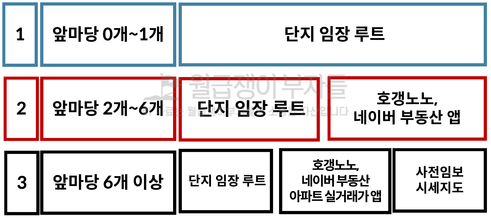

* **가격은 보지 말고 가치에만 집중하는 것이 중요**하다
* **어떤 단지가 선호도가 있고, 긇지 않은 단지를 구별할 수 있을 때** 가격을 보아도 됩니다
* 내가 생각했을 때에 이 단지가 더 좋다는 확신이 드는 순간이 가격을 볼 수 있도록 허락되는 순간이다

##### 임장 단계별 실행 사항

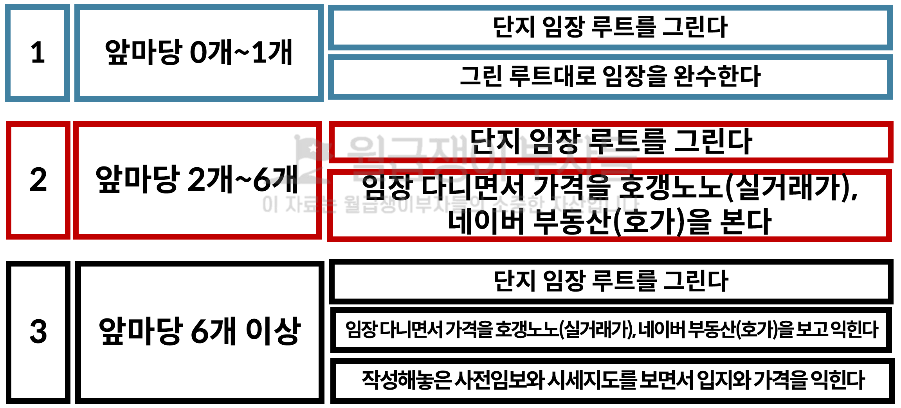

* 1단계는 루트와 수행까지만 하면 성공이고, "**선호 단지 (교통, 몰려있는 단지, 환경 등)를 집중적으로 본다**"
* 2단계 에서는 단지 별 가격을 암기 및 이해를 해야하고, **모든 동의 선호단지를 집중적**으로 본다
* 3단계 에서는 시세를 그룹을 지어서 8억초, 중, 후 기준으로 묶어서 단지를 외우고, "**모든 동의 모든 단지**"를 본다

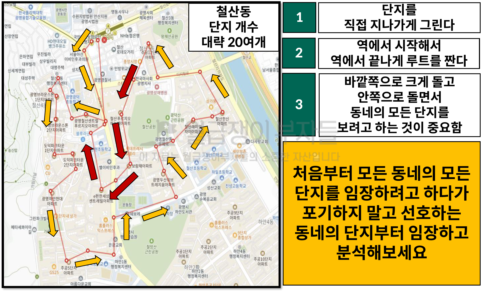

* 바깥으로 돌게 되면 안쪽 단지를 못보기 때문에 안과 밖을 고려해서 동선을 정해야 한다
* 구축은 동간거리, 관리 단지의 차이가 있기 때문에 이러한 특징을 고려하는 것도 방법이다
* 1기 신도시는 낡아서 단지 외부의 편의시설이 있는지 등의 위치를 잘 살펴보는 것도 좋다
* 가격이 이상하게 높다면 학군이 다르거나, 동간거리가 넓고 땅떵어리가 큰 단지는 구축이지만 쾌적해서 인기가 있다

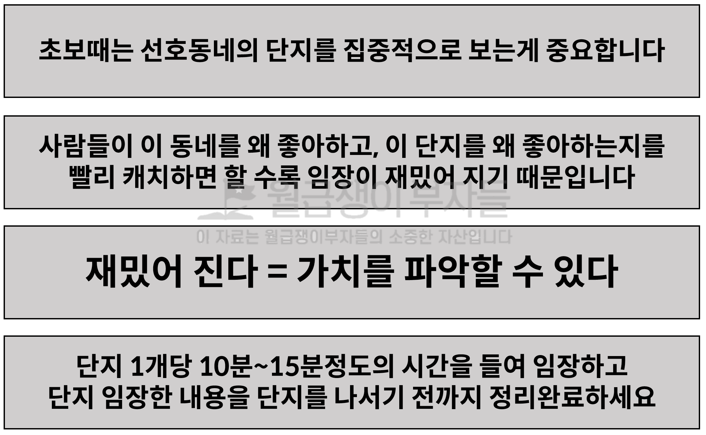

* 이 규칙을 잘 지키려고 노력해야 한다

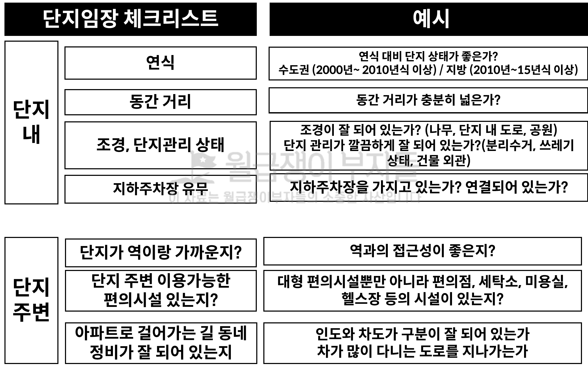

* 소득수준을 잘 파악하는 것이 중요하며, 다양한 요소(편의점 등)에 대한 만족도가 높아야 선호아파트

* 사람들이 **좋아할 만한 이미지와 뷰는 무엇인지를 느낌**적으로 알아야 한다

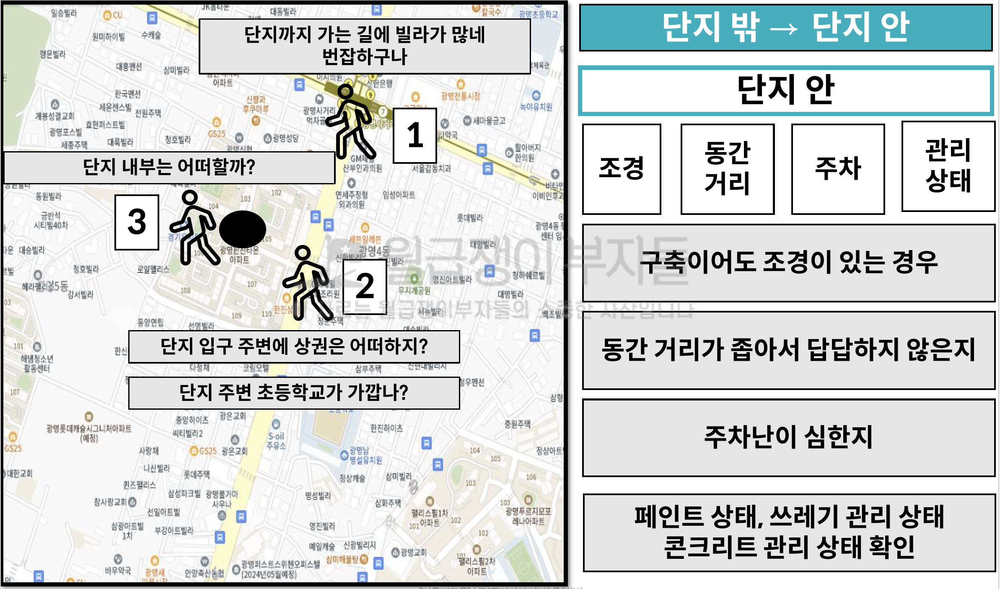

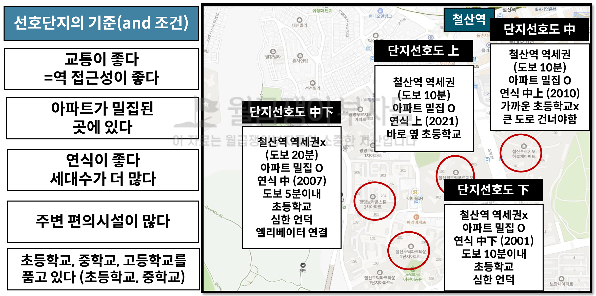

* 개별 항목을 얼마나 많이 좋은 수준으로 갖고 있는 지를 점수로 매겨서 정리되어야 한다

* 단지로 들어가는 동선이 명확한 지, 지나가는 길이 좋은 환경인지, 안전한지 등을 보면 좋다

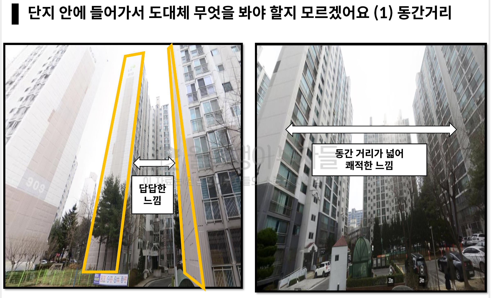

* 프라이버시를 보장할 수 있을 만큼의 거리가 있는가?

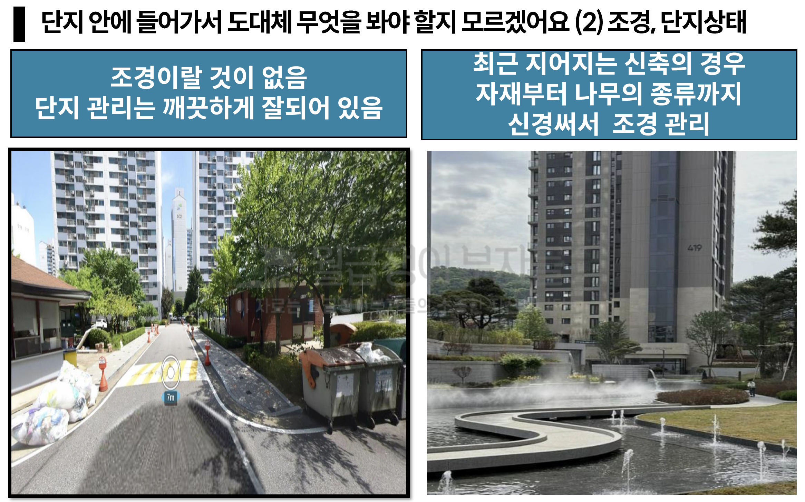

* 단지 관리가 잘 되는지를 봐야 한다. 
* 수도권은 구축 비율이 높기 때문에 조견은 차이가 나지 않기 때문에 **동간거리를 유의미**하게 살펴봐야 하고, **좋은 단지관리 여부**를 확인해야 합니다
  * 소득수준에 영향이 있을 가능성이 높다는 것에 생각이 미쳐야 한다

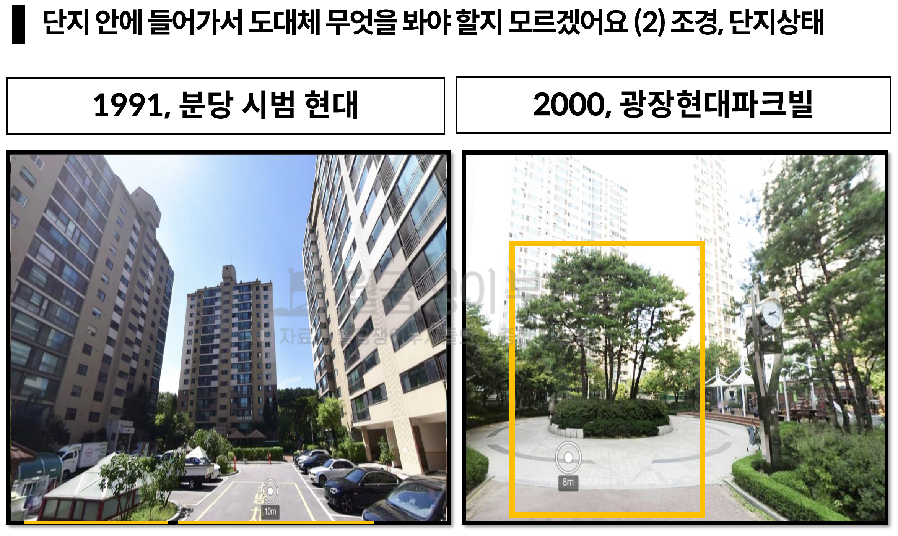

* 16, 18, 30 평대 30평대를 유지하고 있는 단지가 더 좋다

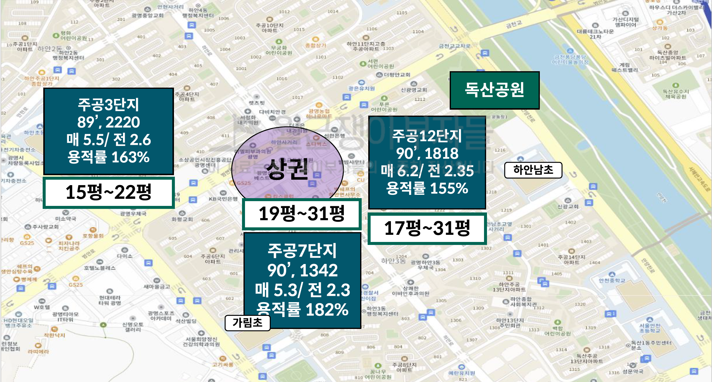

* 당야한 평수가 섞이고 **대형평수가 있으면 쾌적할 가능성이 높**기 때문에 좋을 가능성이 높고, 초품아와 용적률이 낮은 경우를 살펴보며 주공을 바라보자
* 구축은 땅으 ㅣ가치가 있으므로 기본적으로 "단지 입지"를 먼저 봐야 한다
* <u>구축 아파트는 특히 대형평형</u>이 껴 있는 것이 유용할 가능성이 높다 (왜 **동간거리 및 대지면적이 높기 때문**이다)

##### 단지 관리가 안 된 아파트의 느낌

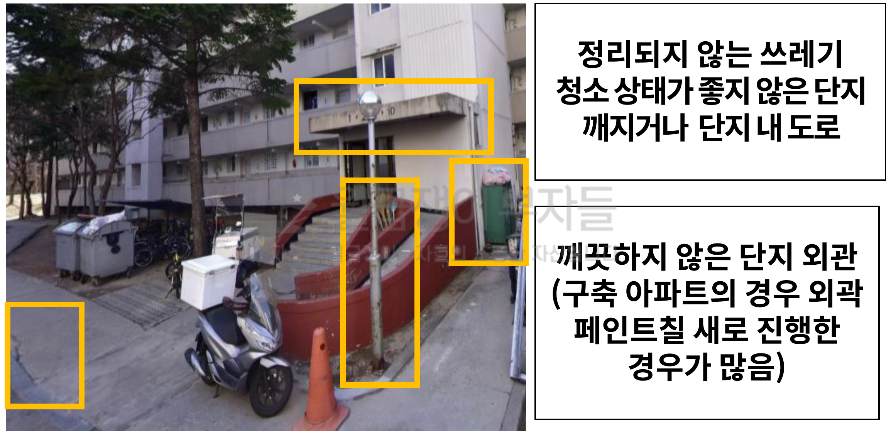

* 대부분의 구축단지는 지하주차장이 연결되지 않으나, **연결된 단지는 상당히 좋은 메리트 중에 하나**다

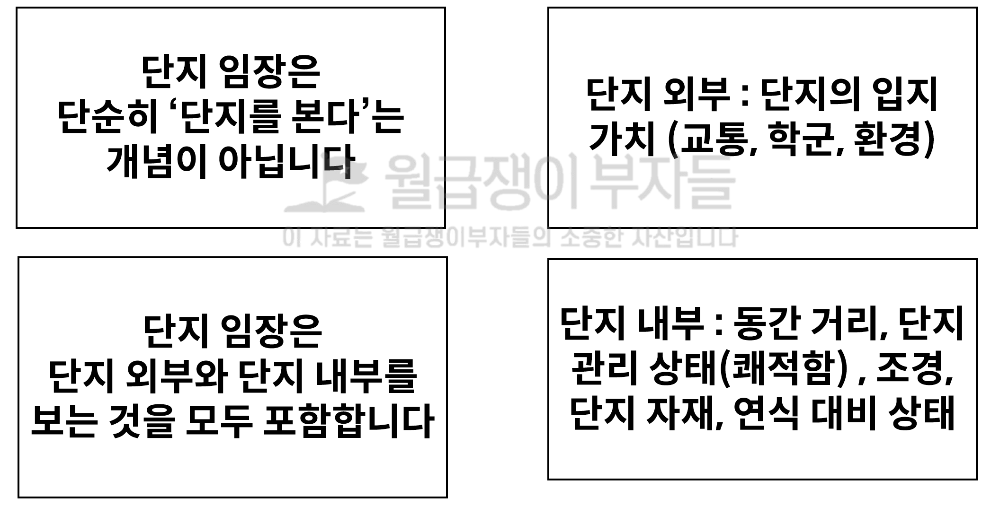

* 외부를 살펴보고 **입지의 가치**와 내부를 살펴보면서 **사람의 선호도**를 살펴보기 위함이 단지임장이다

#### 액션 아이템

* 단지 선호도 파악을 위한 체크리스트 작성하여 출력해 가면 좋겠다
* 좋은 단지를 봐야 상대적인 비교를 할 수 있다
* 80년식 아파트는 패스하고, 구축은 90년식 부터는 임장해볼 가치가 있다