## 루틴: 2024년 4월 10일 (수)

>     

### 오늘의 작업 이력

#### 이력

* 16:00 ~ 20:00 강의 시청

## 발품으로 돈 되는 투자물건 고르는 방법

### 1. 매물 임장으로 극복해야 할 것

#### 1.1 매물 임장을 하는 이유

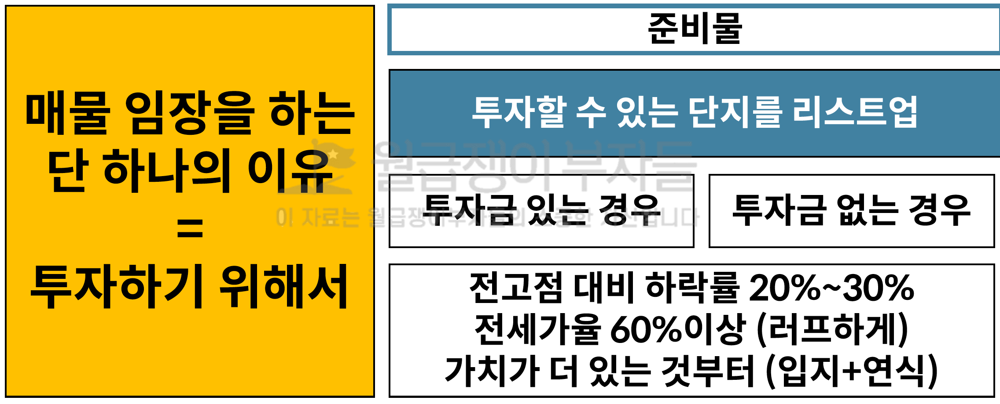

* 이 정도의 수준이라면 임장 후보 대상이 될 수 있으며, 20~30% 라면 무릎정도 될 듯

#### 1.2 어떤 단지를 매물 임장 해야할까요?

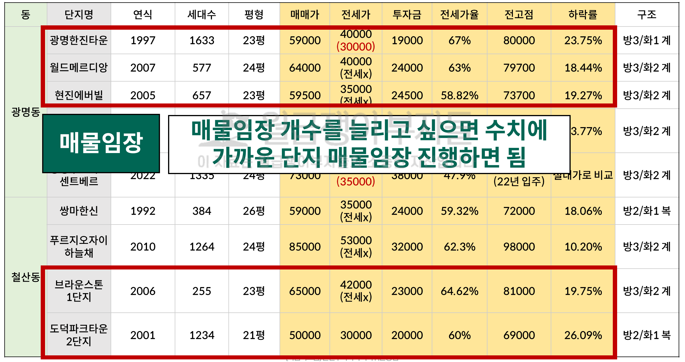

* 매물임장 단지 리스트를 정리하고 시작해보면 되고, 18~19% 라도 사실 현장에서 할인하는 것을 감안해서 스물을 듬성듬성하게 보면 좋다

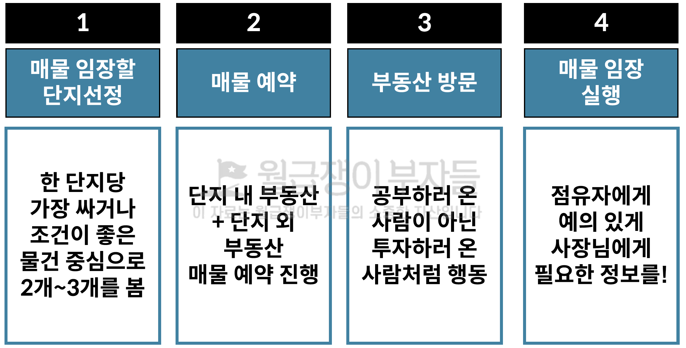

* 너무 많이 본다고 좋은 것은 아니며, **싼 것을 살 수 있는 물건으로 필터**해야 한다
* 단지 외 **유동인구가 많은 부동산114** 같은 경우에도 의외로 물건이 많이 갖고 있을 수도 있다
* 내가 **진짜 물건을 살 사람인 것처럼 행동**하라
  * **단지를 찍고 공부**하고 와서 <u>가격이 얼마</u>고 <u>네고가 안 되는지</u> 조건이 어떠하고
  * <u>전세는 얼마</u>고 전세가 잘 나가는지, <u>투자금이 많이 드는 지</u> 여부와 가격 조절에 대한 것을 물어라
  * <u>네이버 호가</u>가 얼마에 올라왔던데 <u>정말 나가는지</u> 확인도 필요하다
  * **내가 집을 살 것이라면 정말 꼼꼼하고 자세히 매물을 살펴봐야** 한다

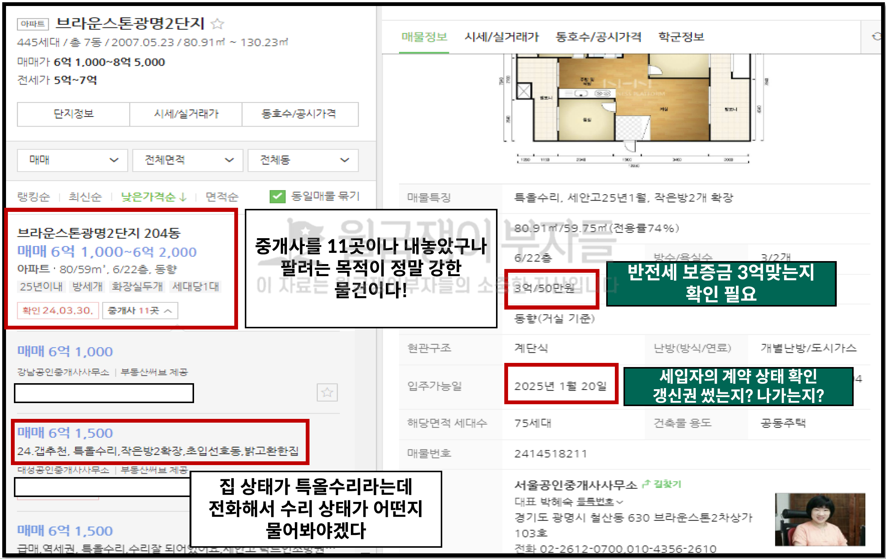

* 많은 곳에 매물을 내 놓았다면 급한 물건이다
* 기본수리는 거의 수리가 안 된 상태며, 올 수리면 샷시를 제외한 것이고, 특올수리라면 샷시까지 다 되어있다고 보면 된다
  * 특히 2년된 특올과 4년된 특올이 있을 수 있으므로 사전에 전화 임장을 통해 확인이 가능하다
* 네이버에 "반전세 보증금 3억" 이 껴 있는게 매물 보면서 문의를 확인해봐야 한다
  * 입주 가능한 일에 정확하게 입주를 하는지, 갱신권 사용 여부와, 나가는 지 여부 등도 사전에 확인해봐야 한다
  * 광명 입주가 많은 시점에 세입자를 구할 수 있는지 여부도 확인해봐야 한다

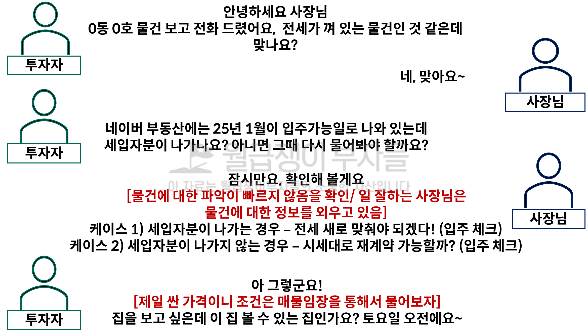

* 사전에 시뮬레이션으로 질문을 다 정해놓는 것이 좋으며, 바로 답변을 주는 사장님이 좋은 사장님이다
* 네이버 물건 중에서 
  1. 가장 매매가가 싸게 나온 물건 부터
  2. 조건이 좋은 물건 (전세가 끼어있거나 집주인이 팔고 싶어서 전세 협조 가능한 물건)
  3. 1+2 모두 충족하는 물건 전화 예약

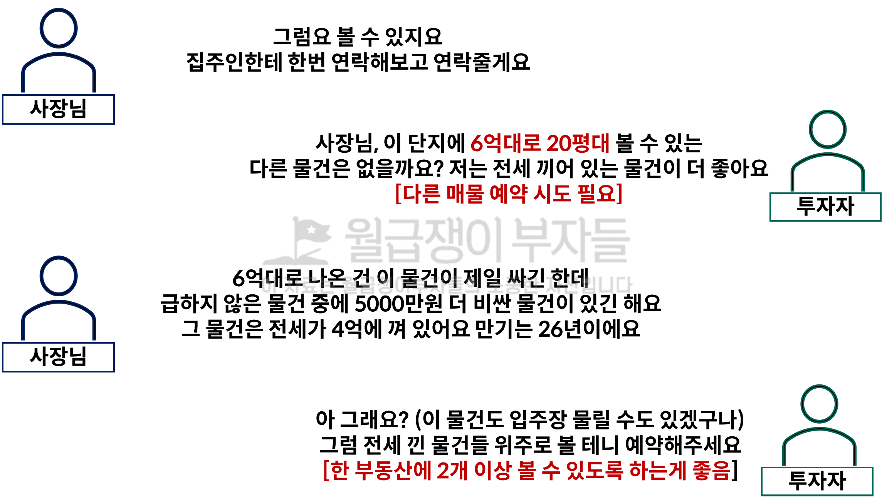

* 내 **예산을 벗어나지 않는 물건에 대해서만 보려고 하는 것이 중요**하다

#### 1.3 매물 예약

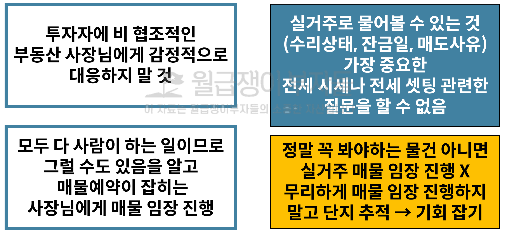

* 부동산 사장님과 관계를 깨는 행동을 하지마라, 결국 부동산 비지니스를 위한 파트를 선택하는 과정이다
* 공부하러 왔죠? 돈 없죠? 투자금 있으세요? 능글 능글하게 넘어가는 게 파트너를 만들 수 있는 기회가 된다

#### 1.4 부동산 방문

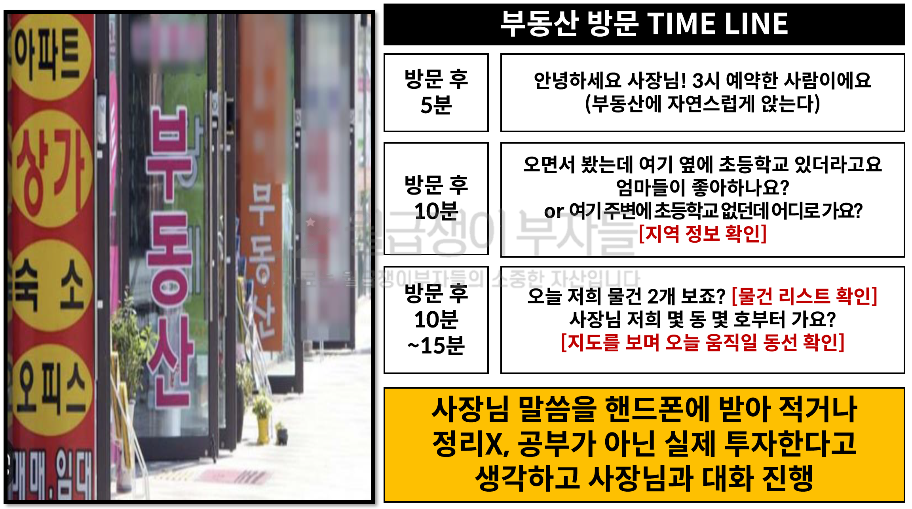

* 내가 원하는 것을 반드시 가장 먼저 얘기를 해야한다
  * 궁금한 점을 물어보는 것도 좋지만, 까칠한 사장님의 경우 상황을 봐서 오늘 뭐 봐요 정도만 장소만 물어봐도 된다
  * 그리고 브리핑 하는 시점에 **궁금한 점을 타이밍에 맞춰서 한 두개 정도만 물어보는 게 좋**다
  * 지역 정보는 우리가 더 잘 알 수 있고, **단지 정보는 사장님이 잘 알고 있**다
  * **대화 진행 중에 뭔가를 적고 하는 것은 좋지 않**고, 몰래 녹음만 해두자

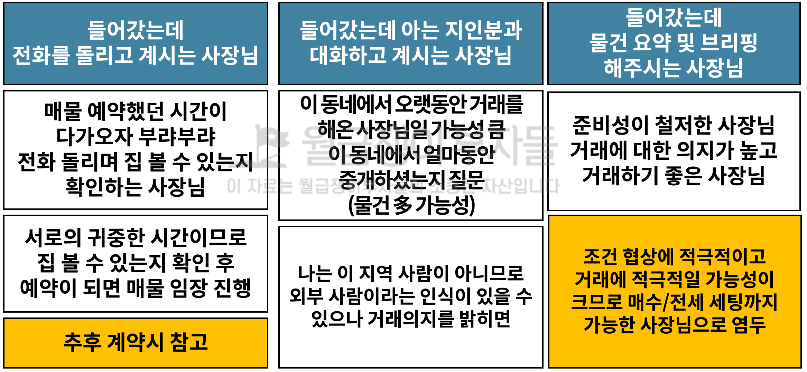

* 매도자와 사이가 가까운 사장님들은 두 가지 타입이 있다
  * 매도자와 사이가 좋아서 깎아줄 생각이 없는 사장님
  * 적극적으로 가격을 고민해주고 제안하는 사장님
* **준비성이 철저한 사장님**을 잘 체크해 두고 추후에 계속 좋은 관계를 맺어두는 게 좋을 듯
* 타입에 따른 사장님
  * 싹싹하고 친절한 사장님은 전세파
  * 화끈하고 추진력있는 사장님은 매매파

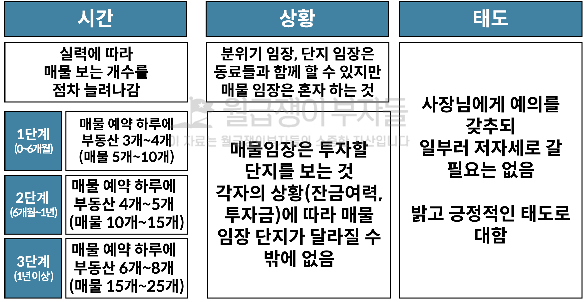

#### 1.5 살 사람처럼 집 보기

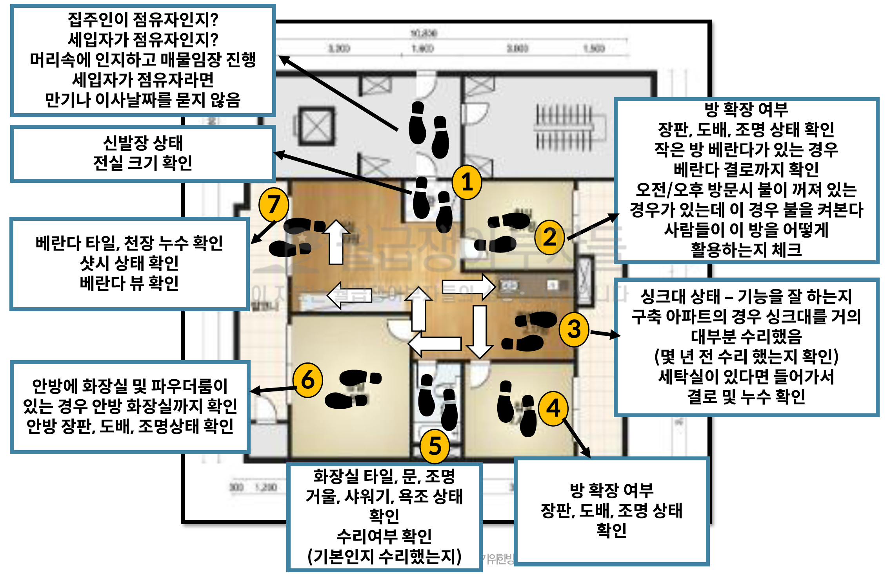

1. 집주인인지 세입자인지?
   * 세입자에게는 만기일을 물어보는 것은 세입자가 불안해할 수 있으므로 물어보지 않는다
2. 신발장이 고장난 경우가 있으므로 확인한다
   * 팬트리 같은 수납장이 있을 수도 있다
3. 전실이나, 중문에 대한 문의
   * 고장났는지 여부와, 직접 설치한 것인지 확인
4. 방으로 먼저 가서 장판, 도배, 조명 확인
   * 수리가 필요한지 확인이 필요하다
5. 모든 베란다의 결로와 곰팡이 확인
6. 확장한 경우 단열공사가 되었는지 확인
   * 부동산 사장님에게 물어보는 게 좋다
   * 겨울에 너무 추워서 이사하고 싶을 듯
7. 작은 방에 침대가 들어가면 활용도가 좋다
   * 침대가 안 들어가면 창고로 쓴다
8. 씽크대로 가서 배관을 살펴본다
   * 씽크대를 살펴보고, 누수 여부를 확인한다
   * 씽크대 상판의 금이나, 곰팡이는 모두 돈이다
   * 씽크대 상태가 너무 나쁘면 전부 갈아줘야 한다
9. 주방옆 세탁실의 결로와 누수 황긴
10. 찢어져 있는 도배가 있는지 확인한다
    * 한 판 도배를 하는데 인건비가 너무 비싸서 10만원 이상
    * 기억해 뒀다가 매도자에게 얘기해야만 하낟
11. 화장실이 가장 돈이 많이 들어간다
    * 수건 넣는 장이 녹슨 경우는 다 갈아줘야 한다
    * 모든 장은 직접 움직여서 확인하고
    * 수리 여부도 확인해야 한다
12. 정상적인 화장실 기능 여부 확인
    * 구축 단지의 안 방 화장실은 사용할 수 있는지 여부
13. 베란다 상태를 확인하러 나가자
    * 타일, 누수, 결로 상태가 가장 중요하다
    * 수납장 상태와 모두 문을 열어봐야 한다
    * 90년대 알루미늄 샷시로는 살 수 없다
    * 결국 난방비와 추위 때문에 세입자가 안 살더라

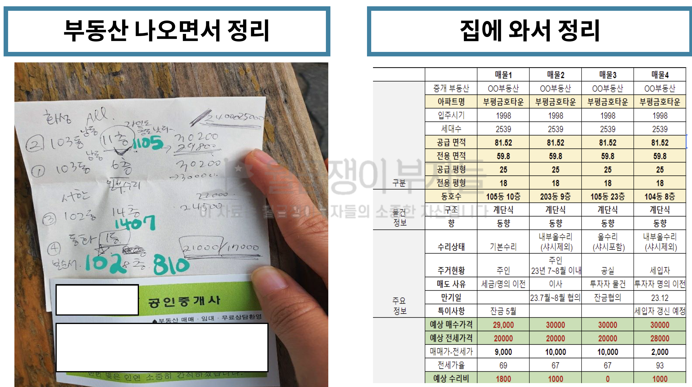

* <u>부동산으로 돌아와</u>서 오늘 본 물건을 사장님과 얘기하면서 하나씩 정리한다
  * 사장님 나는 2번이 제일 싼 것 같아서 다시 연락 드리겠습니다 등과 같이 **제일 좋은 단지 하나만 기억해야 한**다
  * 고민해 봤지만 ... 매수는 못 할 것 같습니다. 와 **같이 관계를 잘 유지해야 한**다
* <u>집에와서 정리</u>할 때, 매물과 조건을 고려해서 뽑아가는 과정을 통해 학습한다

### 2. 투자자로서의 삶

#### 2.1 시간 관리

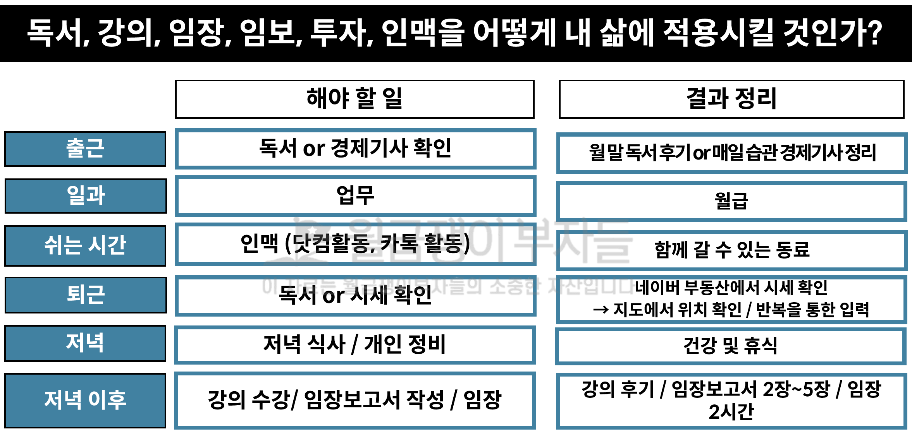

* 에너지가 있을 때에 (출근) 독서, 경제기사 읽는 학습하고, 틈틈이 카톡, 닷컴 등등의 북마크 및 소셜 활동

* 시간 관리의 핵심은 **몰입**이 가장 중요하며, **강의, 임장, 임장 보고서** 이 3가지가 가장 중요하다

#### 2.2 습관 관리

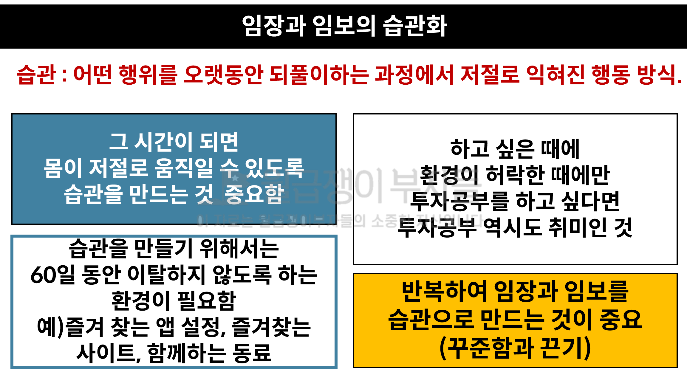

* 주변에 아파트 공부하는 사람들이 많아야 하고, 내 취미 생활을 부동산으로 만들어봐라

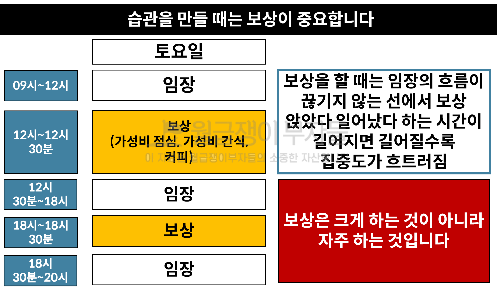

* 우리가 **하고 있다는 것이 가장 중요**하다

#### 2.3 결과

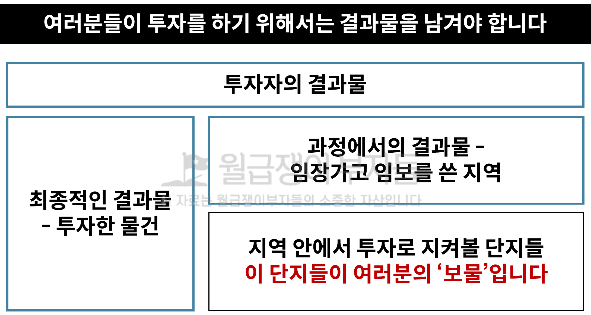

* 우리는 **계획한 대로 잘 수행하는 것에만 집중**해야 한다

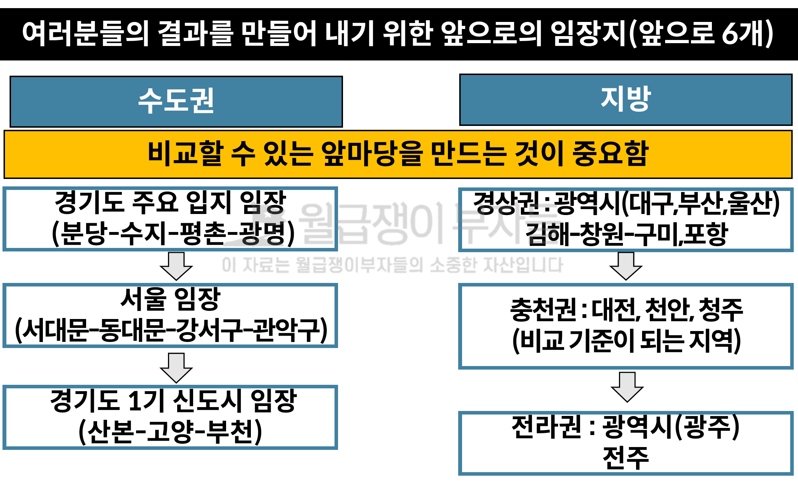

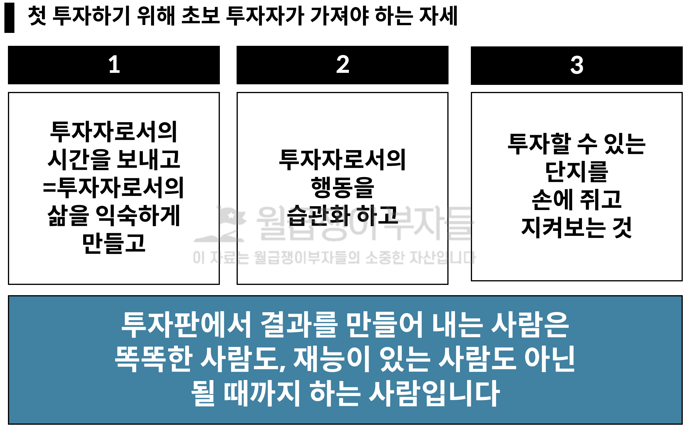

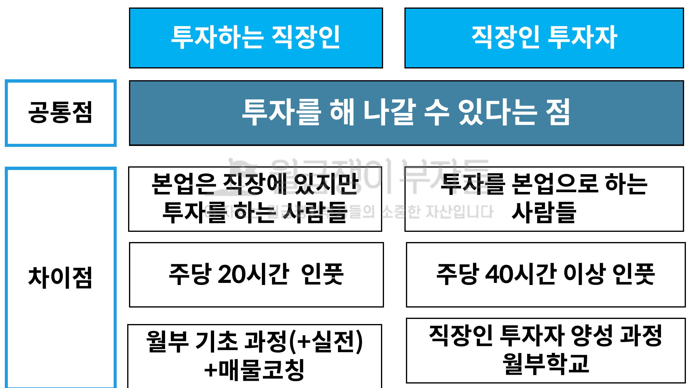

* 투자하는 직장인으로 20시간 인풋을 넣기 위한 계획을 잡아라

* 조그마한 성공도 성공이다

#### 액션 아이템

* 매주 토요일 임장 스케줄
  * 7시 30분 ~ 9시 : 식사 및 이동 (1.5)
  * 9시 ~ 12시 : 임장 (3)
  * 12시 ~ 13시 : 좋아하는 음식을 먹자 (1)
  * 13시 ~ 17시 : 임장 (4)
  * 17시 ~ 19시 : 귀가 및 식사 (2)
  * 19시 ~ 21시 : 임장보고서 작성 (2)
  * 21시 ~ 23시 : 자유 활동 (2)
* "투자하는 직장인"을 위한 시간 계획과 패턴을 잡아라
  * 4월에는 외부 강의를 위한 학습 방향과 시간을 확보하라
  * 5월에는 강의를 위한 부동산과 강의 준비를 위한 일정을 잡아라
  * 6월에 본격적인 부동산 공부를 위한 일정을 세우자

* 2024년에 내가 어떻게 살아갈 것인지를 그려보자

* 4월 7일 할 일
  * 4월 월부 학습 시간 확보
  * 5월 강의를 위한 준비 시간
  * 4월 북클럽 시간 확보

