## 루틴: 2024년 4월 15일 (월)

>     

### 오늘의 작업 이력

#### 이력

* 21:00 ~ 22:00 강의 시청

## 임장보고서를 쓰지 않으면 벌어지는 일

### 1. 개요

#### 1.1 이번 강의의 목적

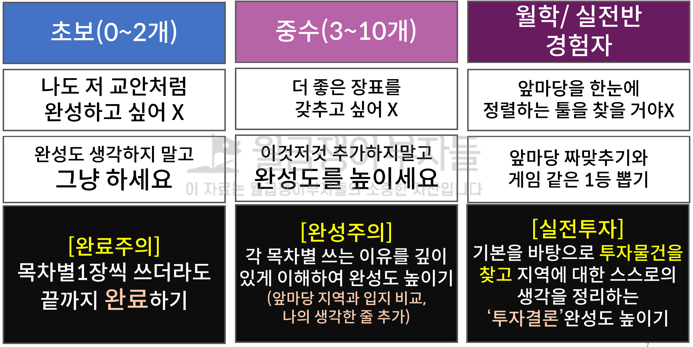

* 임장보고서 목차별 작성 목적과 방법의 이해
* 투자단지를 선별하고 투자결정과정을 배우고 실행한다
* 임장보고서, 이렇게만 쓰면 투자할 수 있다

### 2. 임장보고서를 꼭 써야 하는 이유

#### 2.1 올바른 선택을 위한 첫 걸음

* 숫자로 표현될 수 있어야 올바른 선택을 할 수 있으며, 더 좋은 선택을 하기 위해서

  * 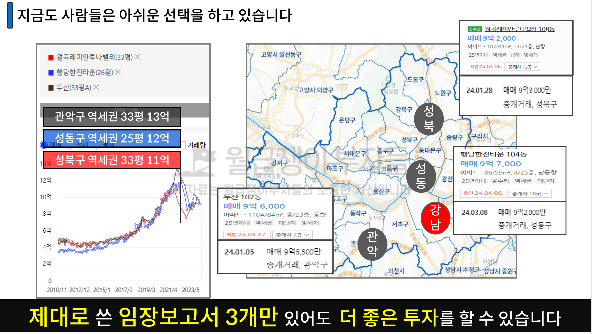

  * 내가 알고 있었던 흐릿한 정보와, 모호한 정보를 통해 결정해서는 안 되며 확실한 정보와 확신이 들 때에 매매해야 한다
  * "**남들보다 더 버는 투자**"
    * 

### 3. 1억 더 버는 임장보고서 작성법

#### 3.1 임장보고서 작성 단위 : 구

* 임장보고서 20개 까지는 **한 번에 한 지역만 제대로 작성**하고 완료해야 한다

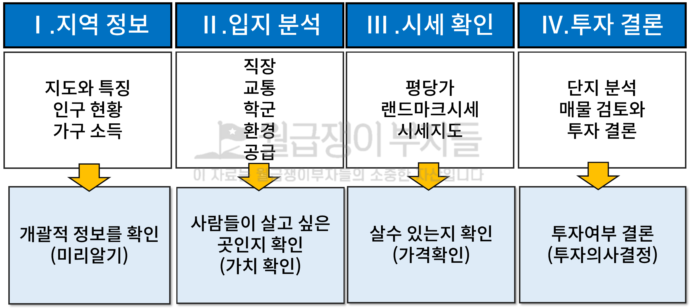

* 지역정보 : 여긴 어디지?
* 입지분석 : 사람들이 원하는, 살고싶은 곳인가?
* 시세확인 : 내 돈에 맞는 단지가 있는가?
* 투자결론 : 그래서 어디를 매매할 것인가?

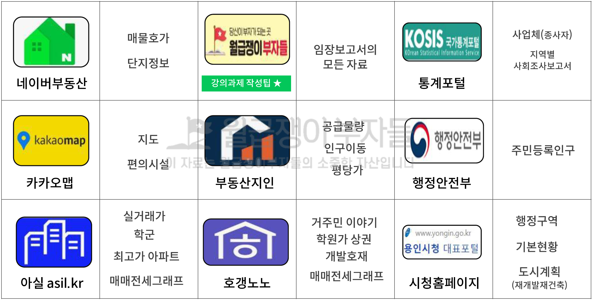

* 네이버부동산, 부동산지인, 아실, 호갱노노 정도만 잘 활용하는 것 만으로도 충분하다
* 통계포털, 행안부 등은 원본 데이터가 반드시 필요한 경우만 참고하지만, 왠만한 데이터는 다른 사람이 만들어둔 것을 쓴다

#### 3.2 지역 정보

> 지역 정보는 개괄적인 정보를 이해하는 수준이므로, 적절한 수준으로만 파악하고 넘어가는 것이 중요하다

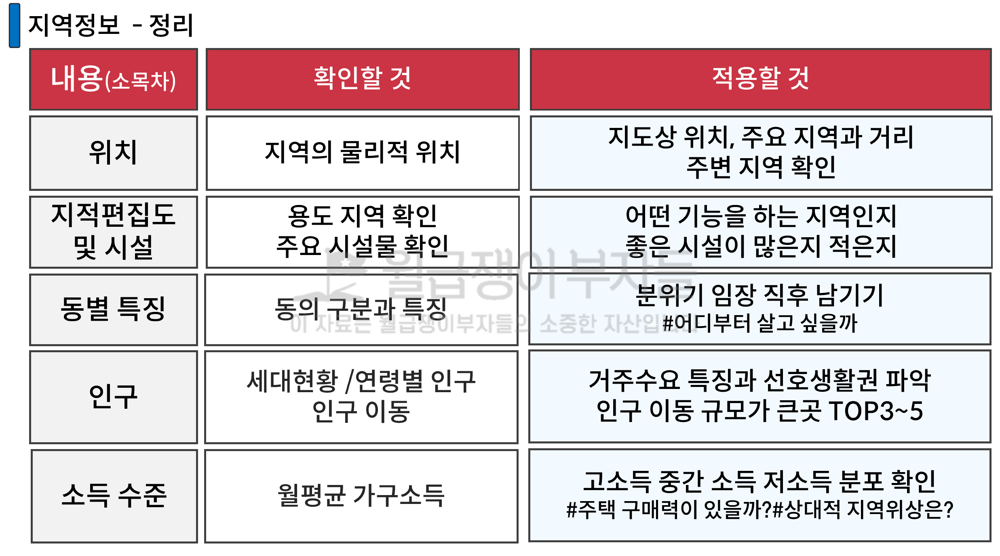

##### 3.2.1 지도와 특징

* "일반지도" : **어디에 있는 동네**이고 **어떤 지리적 특징**을 가지고 있는가?
  * 지도상 위치
  * 핵심 업무지구와의 거리
  * 인접한 지역
* "지적편집도" : **어떤 속성을 가진 토지**를 보유한 지역인가?
  * 지적도와 시설물
    * 사전에 지역에 대한 이해와 거리뷰 등을 통해 사전 분위기 임장도 가능
    * 
  * "지적현황" 과 "주요 시설물" : 지역의 **성장에 영향을 주는시설**을 가지고 있는가?
    * 복합적인 구도 있지만, 베드타운 특성을 지닌 지역도 있다는 점을 파악할 수 있다
    * 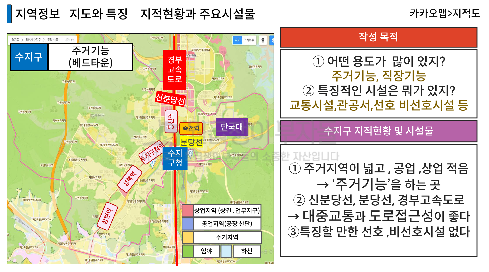
    * 고속도로에 따라 지역을 단절시키고 서로 이동이 어려운 점 등을 이해할 수 있다
  * "동별 특징" : **어떤 사람**들이 **어떻게 살고** 있는가?
    * 사람, 지형, 상권 등을 내가 느낀 그대로 구체적으로 작성하는 것이 좋다
    * 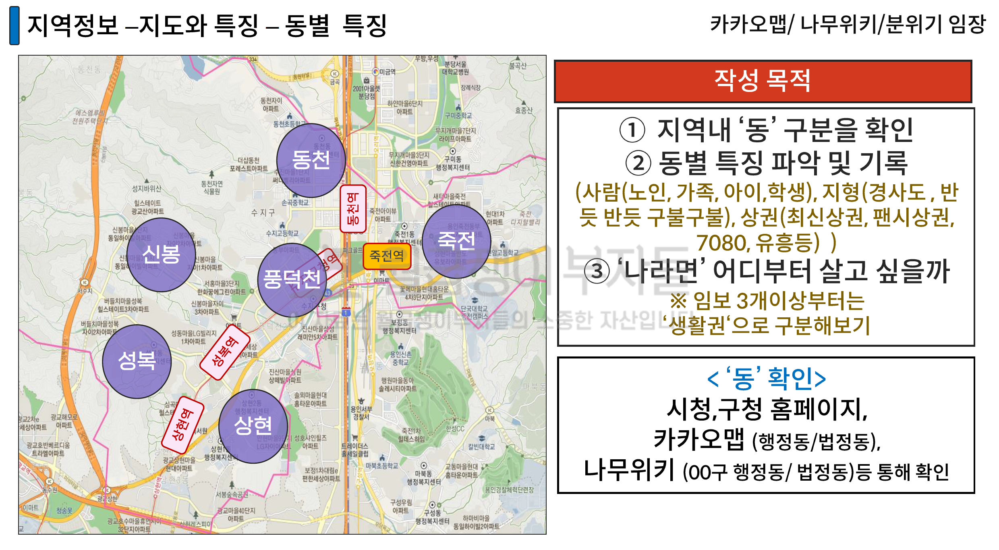
    * 분위기 임장의 기억이 휘발되지 않도록 남길 것
    * 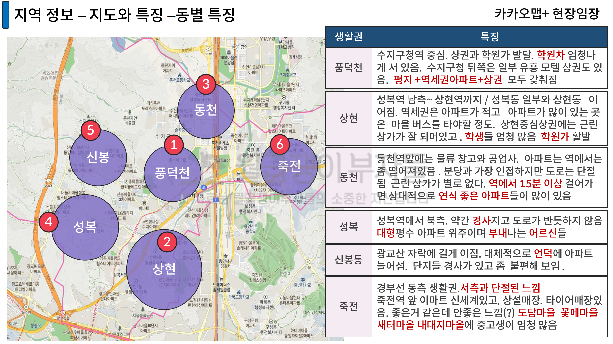
      * 풍덕천 : 상권
      * 동천 : 휑한 하이웨이
      * 성복 : 부유한 할아버지, 할머니
      * 죽전 : 난개발
* 위성지도
* 행정/법정 경계

##### 3.2.2 인구 현황

* 어떤 **연령대** 사람들이 살고, 어디로 **이동**하는지

  * 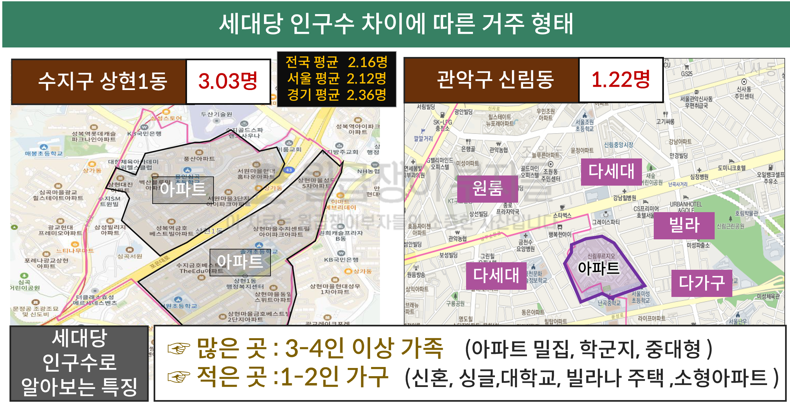

* 지역 내 **가족단위 세대가 살고싶어 하는 곳**은 ?

  * 세대 당 인구 수가 2.5만 넘어도 사람들이 많이 사는 구나를 추측 해볼 수 있다
  * 용산, 관악구는 아파트가 맞지 않아서 세대수가 낮은 경우도 있다는 것도 알고 있으면 좋다
  * [행안부 주민등록 인구](https://jumin.mois.go.kr/) 통해서 다운로드도 가능하지만 카페 다운로드 해서 쓰는 것을 추천

  * 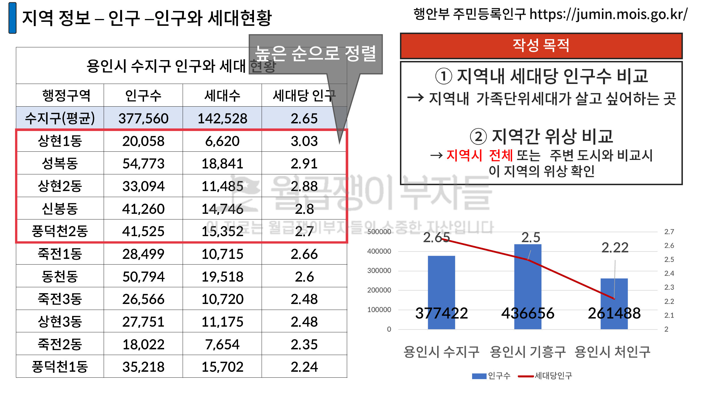
    * 상대적으로 내가 보고 있는 지역보다 많은 곳, 작은 곳을 미리 체크 할 것
    * **임장 시에 기대와 비교해보거나**, 주변 도시 혹은 용인시 평균 대비 어떤지를 통해 **지역의 위상을 파악**한다

* **젋은 세대는 교통 선호**가 높고, **영유아 초등전의 경우 이사가 자유로워 신축**을 선호, **초/중고 부모 세대는 학군**을 선호

  * 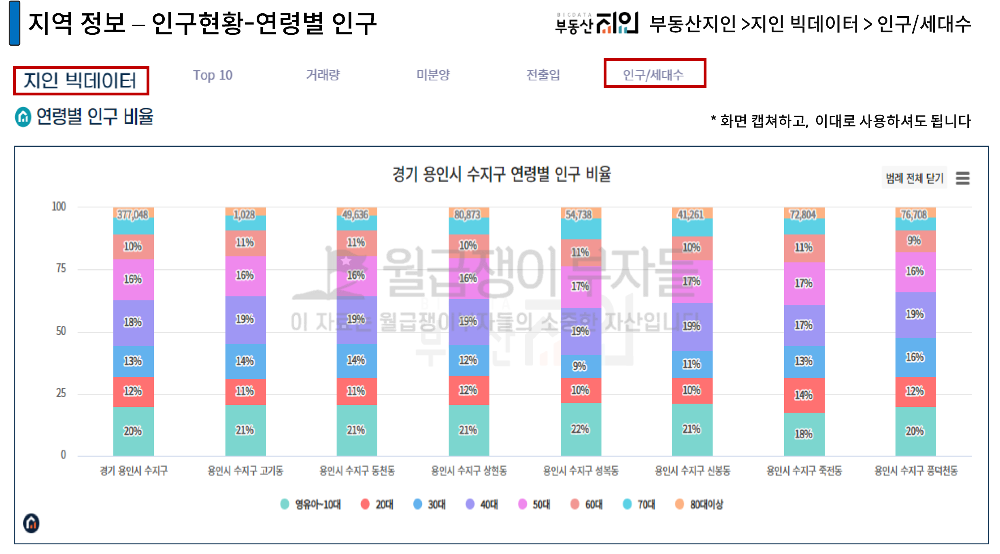
  * 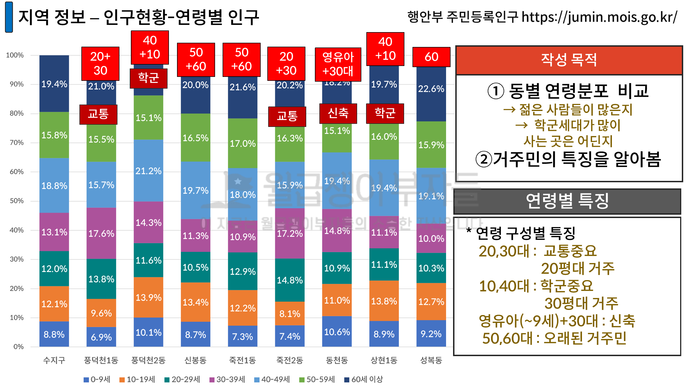

* **주변 공급에 따른 세입자 확보 리스크**를 체크해야 한다

  * 3년간 인구이동이 활발한 지역의 입주물량이 터질 때에 나의 세입자를 가져가나?
  * 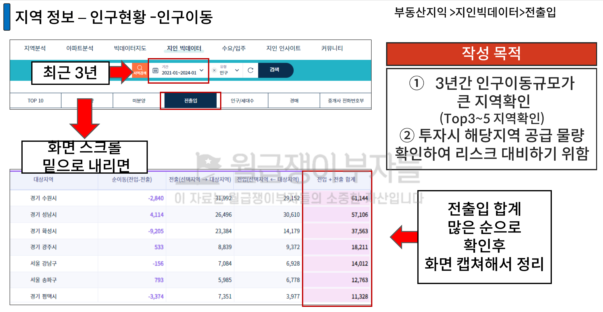
  * <u>지도 위에 올려서 입체적으로 분석</u>하는 것도 큰 도움이 된다
  * 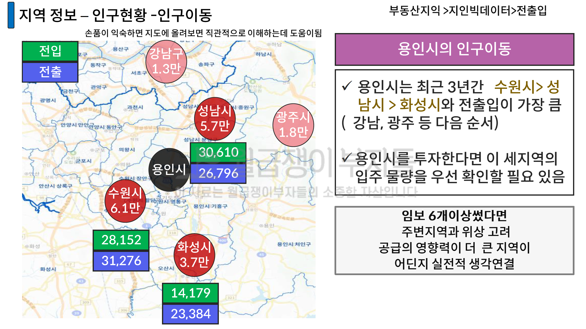
    * 입주물량이 터질 때에 상위 지구인지, 하위 지구인지에 따라서 영향도 파악을 할 수 있다
      * 상급지로는 잘 빠지고, 하급지로는 잘 빠지지 않는다는 점

##### 3.2.3 가구 소득

* 소득정보를 통해서 **구매력이 충분히 있는 지역**인지를 파악한다
  * 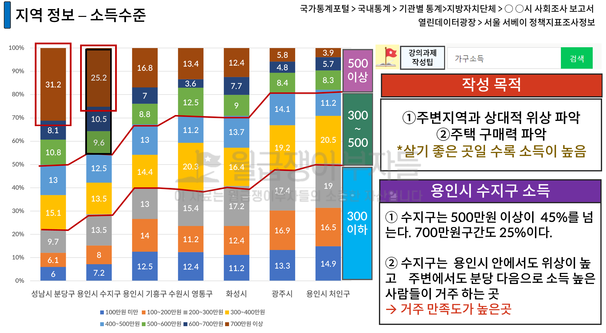
    * 데이터가 파편화 되어 있어서 시간이 아깝고 정리된 자료를 다운로드 받아서 쓰는 것을 추천
    * 

### 4. 인생을 새롭게 만드는 법

#### 액션 아이템

* 4월에 임장 보고서 2개 완성하기
  * 선생님 장표를 똑같이 그대로 만들기
  * 장표 하나 하나의 목적을 말할 수 있다
  * 타인에게 제공하여 납득할 수 있다