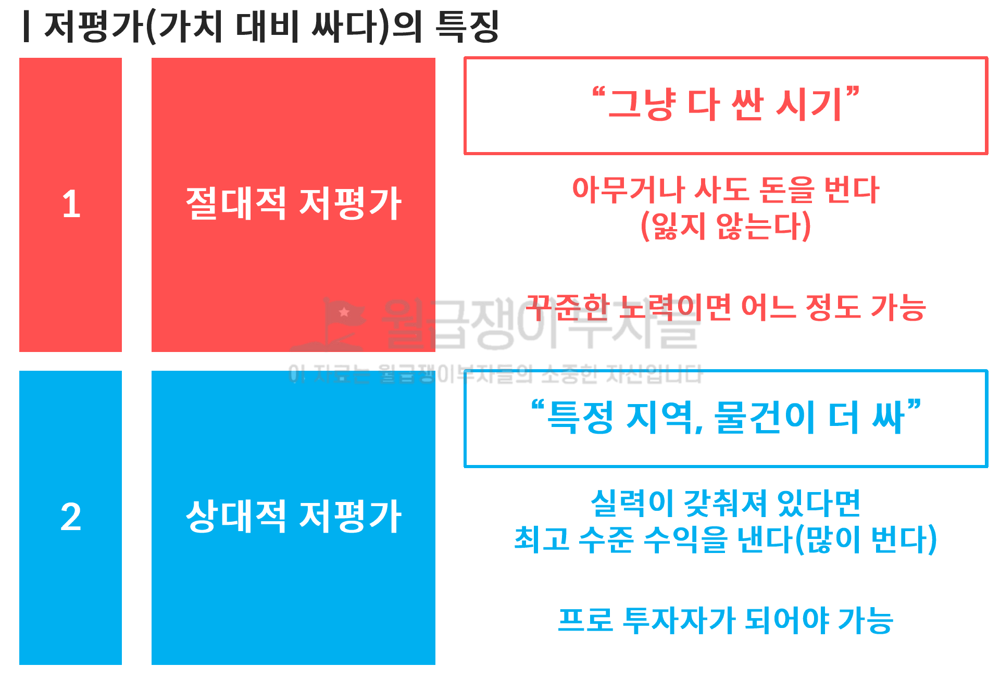

# [월부실준반] 실전 투자자 마인드 - 3. 저평가 판단

## 실전 투자 마인드 (3/3)

### 2. 저평가 판단

* 
  * 절대적 저평가 : 위기가 기회다
  * 상대적 저평가 : 조금 더 넓게 다양한 생각을 해야 한다

* 

#### 2.1 절대적 저평가 시기에 생기는 일

* 
  * 고양시 화정동 - 은빛, 별빛, 햇빛 마을

* 
  * 전세가 안 비싸다는 것이 보여야 한다 - 당시의 전세와 지금의 전세는 차이가 거의 없다

* 
  * 잃지 않았던 시기는 무조건 사는 게 이익인 시기도 있다

#### 2.2 상대적 저평가를 이해하면 생기는 일

* 
* 
  * 한 발자국 더 나간다면 화정 대신 강변으로 갈 수 있다 - 결국 **꾸준하게 임장과 임보를 하는 것만이 답**이다 - 지금도 있을거야
    * 경기도 7~8억 아파트 (신축) 9억 이지만 서울에 신축이 아니지만 더 싼 것도 있다 10년 후를 바라봐라
    * 어떠한 시장 상황이라도 "**같은 돈으로 살 수 있는 것들 중 좋고 나쁨이 있다**"
    * **비교 평가를 통해 가치과 가격의 불균형 여부를 확인**하고 더 좋은데 싼 것을 사야 한다

* 

#### 2.3 절대적 저평가를 판단하는 방법

* 

  * **PIR (Price Income Ratio)**
    * 집값 / 소득 = PIR 이 낮을 수록 집값이 싸다
    * 부동산 가격은 한국 경제의 성장을 따르는 것 즉, 경제 상승에 따른 "**평균 소득**" 이 늘어나는 것에 가장 큰 영향을 받게 된다
    * 국가의 국민의 소득이 계속 늘어나는 지 여부에 따라 집값에 영향을 주게 된다
      * 
      * ![[그래픽] 내집 마련 예상 소요 기간 및 현황](/private/images/2024-05-15-siljun-day15/GYH2023122200060004400_P4.png)

  * **전세가율 (갖고 싶은 마음을 충족하는 비율)**
    * 평균 전세가율이 70%인데 65%면 싸다고 볼 수 있따
    * (Live + Buy) / (Live) 는 분자에 Buy 만 남게되면 이는 갖고싶은 마음을 돈으로 환산한 것이 갭
    * 갭이 작다는 것은 갖고싶은 마음이 별로 없다는 의미다
    * 지방이 서울보다 전세가율이 높다는 것은 지방의 집을 갖고싶어 하지 않는다

  * 최근 신축과 구축의 매매 전세 가격이 비슷하게 바뀌는데 왜?
    * 집은 갖고싶기는 두려워, 살고 싶다면 신축에 살아간다
    * 2023년 하반기 부터 신축 아파트 전세가가 상승하고 있다
    * 이런 환경이라면 신축 아파트도 경쟁력이 있을 수 있다

* 

  * 어떻게 결정하면 되는가?
    1. PIR 이 평균 11 이하로 떨어졌는가로 절대적 싼 수준에 진입함을 인지
    2. 전세가율이 65% 이상으로 올라갈 수 있다면 절대적 저평가 시기라고 판단

  * 현재는 일부 싼 가격이 되었지만 전세가율이 못 미친 상황입니다
    1. 전세가율이 높다는 것은 <u>매매가 너무 비싼 경우</u>에 발생
    2. **현재 전세는 싸면서 전세가율이 낮다** - <u>종잣돈 여유가 있고 5년 이상 길게 본다면 살 수 있다</u>

* 

  * 각 5천, 1억, 2억 자금으로 투자할 수 있는 매물이므로 각자의 자금에 맞는 투자 단지에 투자를 하기만 하면 수익을 낼 수 있는 시기
    * **내 투자금 대비 최고의 선택이 맞는지를 한 번 더 생각해** 보아라

* 

  * [KB부동산](https://kbland.kr/) : PIR (월별) / 28. 아파트 매매 전세비율 변환 해볼 것, 3개월에 한 번씩 계속 업데이트 한다
  * **서울이라는 대표도시의 PIR과 (11.2)** 전세가율을 ㅌ오해 하나의 기준을 설정할 수 있다

#### 2.4 지방의 절대적 저평가

* 

  * 지바의 PIR 은 확인하기 어렵기 때문에 서울과 비교해서 (서울이 비싸지 않은데) 비슷하면 지방이 비싸다고 판단할 수 있다

  * 

    * 지방 대장 아파트

      * 문수로 : 부산
      * 도룡SK뷰 : 대전

    * 도원 삼성 래미안 : 서울 마포 - 2014 ~ 2018 까지는 서울 저평가

      * 래미안 : 서울 (제외)
      * 언젠가 다시 지방과 도원삼성 래미안이 만난다면 !? 서울이 싸다고 볼 수 있지 않을까?
      * 서울 도원 삼성 PIR 이 충분히 싼데 지방이 더 싸다면 .. 싸다고 볼 수 있지 않을까?

    * **서울 (마포, 용산, 성동구, 광진구, 분당) 대장 아파트 vs. 지방 대장 아파트 비교**

      * 30평대 선호도 높은 구축 아파트 (얘네들은 대충 비슷함) 지방 대장 아파트와 비교하면 좋다
      * 

      * **이후 저평가 되어 있는 것으로 보이는 도시의 사항을 분석한다**
        1. 도시 전체 전세가율 (과거 대비 높아진 것인지)
        2. 전용 84 매매가 기준 탑 30 아파트 가격과 전세가율이 아파트들의 가격이 싸보이는지 확인
        3. 그리고 전세가율도 80% 이상인 것들이 많다면 도시 전체를 살펴본다
      * **2019년 서울 대비 지방 저평가 (부산, 울산, 광주)**
        1. 부산, 울산, 광주 전세가율 모두 확인 후 확신
        2. 투자 진행 (단, 지방 구축 아파트 투자 제외 - 같은 돈으로 사람들이 좋아하는 아파트)
        3. 이후 매도 여부 결정

#### 2.5 절대적 저평가 판단하는 법

* 서울 일자리 (시청, 여의도, 가산, 강남, 판교)
  * 마곡은 임대가 많아서 목동으로 간다더라. 강서구가 앞으로 전세 구하기가 쉽지 않을 것이다
* **한강 이남으로 우선순위를 잡**아라

#### 2.6 비교 평가

* 
  * 수지 진흥 6단지 아파트 : 절대적 저평가 시기에 상대적 저평가를 할 수 있는 능력이 있었기 때문에 가능했다
  * 전세로 고통 받는 사람이 없기 때문에 현재는 전세난 해결 방안을 고민하지 않는다
    * 전세 고통을 받게 되면 가장 쉽게 전세난 해결하는 척이 **다주택자를 양성하는 정책을 펼칠 것**이다

* 
  * 주인이 세금 떄문에 팔고 주전계약을 하는 경우가 지금도 있다
  * **현 시세가 4.9 억인데 내가 싸게 3.5억으로 내 놓았으니 4.9 따라잡을 때까지 계속 5% 늘릴 것이니까 계속 연금처럼 나오는 통장이 돈 나무**

* 왜 이 아파트를 샀을까?
* 
* 내가 해야 할 질문 들
  * "얘가 쟤보다 좋은데 가격이 더 싸네?"
  * "얘가 쟤보다 좋은데 가격이 같네?"
  * "가격이 같은데 쟤가 얘보다 훨씬 좋네?"
  * **같은 값이면 당연히 저게 낫지**
* 판단하기 어렵다면 "모의 투자"를 계속 해봐야 한다
  * 글로써 이 물건을 내가 돈을 주고 샀다고 상상하고 로깅한다
  * 어느 순간 가격이 벌어지는 것을 내가 생각했던 expected 와 변화한 actual 과의 차이에 대한 검증을 한다
  * 실제로 투자도 해서 회고를 하고 학습을 해야한다

* 
  * 결국은 입지를 보면서 계속 아래와 같은 질문을 해야한다

* 
  * **가격과 가치의 불균형이 오는 것은 기회**다
  * 눈에 보이는 것 만큼 내가 어디에 있는지가 중요하다
    * 내가 보던 것들만 보면 판단이 흐려진다 ... 지하철을 직접 타면서 얼마나 먼지를 느껴봐야 한다
    * 강남에서 직접 가보면서 생각이 달라질 수 있다 ... 힘들어도 무조건 가봐야 한다

* 비교 대상 지역 분석
* 
  * 수지와 죽전은 강남 가는 길이 훨씬 차이가 나는데 왜 가격이 같을까?
    * 부천, 중랑구, 성동구, 중구, 서대문, 방화동 등을 다 비교하면서 살펴봤다

  * 비교 시에 수요층이 동일한 같은 평형끼리 비교
    * 상급지 구축 vs. 하급지의 신축 비교는 어리석은 질문이다 ... 즉 신축 구축의 건물 비교는 의미가 없다. **땅이 중요**하다
    * 올바른 비교는 "**땅의 위치를 제외한 나머지 요소는 모두 동일하게**" 해둬야 소음이 제거된다
    * 이 지역 신축과 저지역 구축이 아니라 이지역의 신축과 저 지역의 신축을 비교해서 땅을 비교한 이후에 검토한다

#### 2.7 비교 평가 기초

* 
  * 모두 **구축, 같은 32평형, 유사한 매매가를 가져다 놓고 비교하는 것이 중요**하다

* 
  * 내가 선정한 기준에 미달하면 제외한다 - 전세가 85%, 투자금 5천 이하가 아니므로

* 
  * 내 물건들 사이에서 상대적 비교만 잘하면 된다
  * 직장/교통 > 환경 > 학군 : 서울 초등학교가 점점 줄어든다 - 아이들이 줄어드는 이유가 환경이 좋지 않기 때문이다
  * **반포, 잠실, 용산 이촌동 같은 분위기**가 드는 동네로 가야한다

* 
  * <u>입지가 다른데 가격이 동일하니까 저평가된 물건을 선택</u>할 수 있다
  * 중랑이 더 나은 점은 서울이라는 점을 놓쳤다

#### 2.8 비교 평가의 순서

* 
  * 매일 매일 비교 평가해 보아야 한다

* 
  * 2년 간 계속 돌아다니면서 분석하는 것과 아는 지역을 계속 늘리는 것

* 

* 
* 
* 
* 
* 
  * 결국 앞마당을 많이 만드는 것만이 비교대상을 만들어볼 수 있다

* 
  * 10년 중에 임장하고 공부할 시기는 2~3년 밖에 안 된다

* 
  * 결국에 남는 것은 좋은 건물 밖에 없기 때문에 좋은 입지의 아파트를 투자하라

* 
  * 하루에 2시간 이상 투자금에 맞게 서울/경기도 쪽으로 수시로 아는 지역을 넓힐 것 (지방 제외)

### 3 아파트로 돈 버는 법

#### 3.1 아파트로 돈 버는 종류와 정의

* 
  * 본인의 업이 중요하고 시간이 없는 자영업, 사업 및 전문직 즉 연봉의 뚜겅이 없는 사람들 - **절대적 저평가 시기만 잘 잡아 갈아타기만 잘 하면 된다**
    * 1주택 올인 : 하나 제대로 구하고, 시점에 맞춰서 지속적으로 갈아타는 전략

    * 일시적 1가구 2주택 : 많은 이사를 감수하면서 까지 세 끼고 하나 사고, 비과세를 받으면서 불려 나가는 전략

  * 자산 축적이 중요하고 시간 만들 수 있는 사람 월급이 한계가 있어 뚜껑이 있는 직장인 주부 - **절대적 저평가 + 상대적 저평가** 
    * 가치 성장 : 어느 정도 투자금이 있기 때문에 물건의 가치와 가격에 집중하여 마지막에 좋은 물건만 남게 되는 전략

    * 소액 투자 : 자금이 부족한 상황이라 (40대 이전) 가치보다 규모와 가격에 집중하는 전략

* 
  * **1주택의 최고 수익을 내는 아파트를 유지하는 경우에 최대 10억**
    * 분양을 미루고 미뤄서 정말 싸게 분양을 받아서 끝없이 상승만 경험한 아파트도 있다

* 
  * 최대 6.6억 까지 벌었다고 하더라도 결국 노후 대책이 안 되어 팔거나 연금주택으로 전환하는 방법 밖에 없다

* 
  * 투자 횟수가 많지 않으며, 투자금 규모보다 물건의 가치와 가격에 집중 - 꾸준하게 계속 공부하고 관심을 갖고 10년 이상 취미처럼 투자하는 것
    * 1번에서 전세금을 받아서
    * 2번에서 재투자로 선택
    * 3번에서 많은 하락을 기회로 투자

* 
  * 보유 투자금이 쌓일만 하면 계속 투자하는 것을 반복하는 것
    * 임사 종료 후 양도세 감면 매도 혹은 일반 과세 매도
    * 차익 중 50% 9억 재투자 + 50% 10억 은퇴준비금 (에어백)

* 
  * 

* 
* 
* 
* 
  * 임사 종료 후 양도세 감면 매도 혹은 일반 과세 매도
  * 차익 중 50% 14억 재투자 + 50% 14억 은퇴준비금 (에어백)

### 4. 내게 맞는 투자

#### 4.1 내게 맞는 투자

* 
  * 1주택자: 내마-내마중급-서기/지기-매물문의
  * **다주택자: 열반-실준-중급-서울기초-실전/매물-학교**
    * 지방은 고민할 필요가 없다

  * 소액투자: 열반-실준-중급-서울기초/지방기초-실전/지실+매물문의-학교

* 

#### 액션 아이템

* **하루에 1시간 정리한 내용을 혼자서 복습 하는 시간을 가지는 것**
  * 하루에 2시간 이상 투자금에 맞게 서울/경기도 쪽으로 수시로 아는 지역을 넓힐 것 (지방 제외)
* 2주택을 목표로 노력하다 보면 정책이 바뀔 것이다
* 좋은 질문 습관
  * "얘가 쟤보다 좋은데 가격이 더 싸네 / 같네?"
  * "가격이 같은데 쟤가 얘보다 훨씬 좋네?"
  * **같은 값이면 당연히 저게 낫지**
* 판단하기 어렵다면 "**모의 투자**"를 계속 해봐야 한다
  * 글로써 이 물건을 내가 돈을 주고 샀다고 상상하고 로깅한다
  * 어느 순간 가격이 벌어지는 것을 내가 생각했던 expected 와 변화한 actual 과의 차이에 대한 검증을 한다
  * 실제로 투자도 해서 회고를 하고 학습을 해야한다
* 올바른 비교는 "**땅의 위치를 제외한 나머지 요소는 모두 동일하게**" 해둬야 소음이 제거된다
* **반포, 잠실, 용산 이촌동 같은 분위기**가 드는 동네로 가야한다
* 아는 지역이 2군데만 넘어가도 매일 비교평가해 보아야 한다
* **서울의 평균 매매가 - 전세가 차이가 1천만원씩 줄어든다**

* **가치 성장 투자의 취미 생활처럼 즐기며 하라**
  * 서울에 아는 지역 많이 늘리기
  * 한강 이남에 아는 지역 늘리기
  * 잘 아는 단지에 투자에 충분히 좋은 집이 나오면 사고
  * 이후에 돈이 없더라도 2년 후에 돈 모은 거 + 전세금 나오면 다시 투자
* **나는 전문업을 계속 갈고 닦으면서 취미 생활로 부동산을 공부하자**

#### 레슨

* **비교 평가를 통해 가치과 가격의 불균형 여부를 확인**하고 더 좋은데 싼 것을 사야 한다
* **최고 수준의 투자를 한다는 것은 ?**
  * 최대한 많은 앞마당을 만들고, 한 달에 하나씩 임장 보고서를 만드는 것
  * 그리고 내 투자금 대비 최고의 선택이 맞는지를 한 번 더 생각하고 행동에 옮기는 것
* **어떤 것들에 투자할 지 아는가?**
  * 절대적 저평가 구간과 상대적 저평가를 통해 매물을 선정할 수 있고
  * 투자를 행동으로 옮길 수 있는 확신을 가지는 상태

* **나는 어떤 투자를 하는 지 알고 설명**
  * 남들이 너 왜 그걸 투자해 라고 말을 들었을 때에 당당하게 말할 수 있는 것
