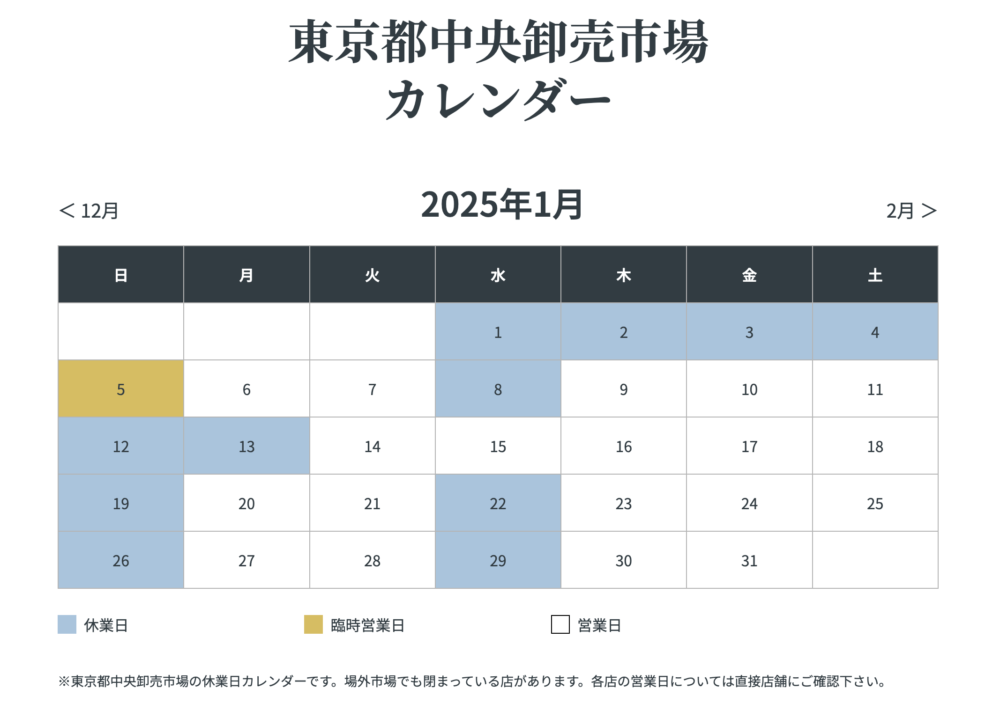
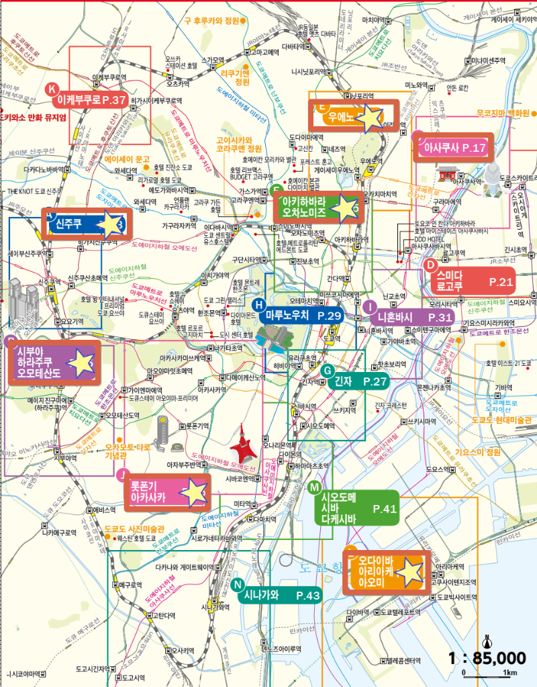
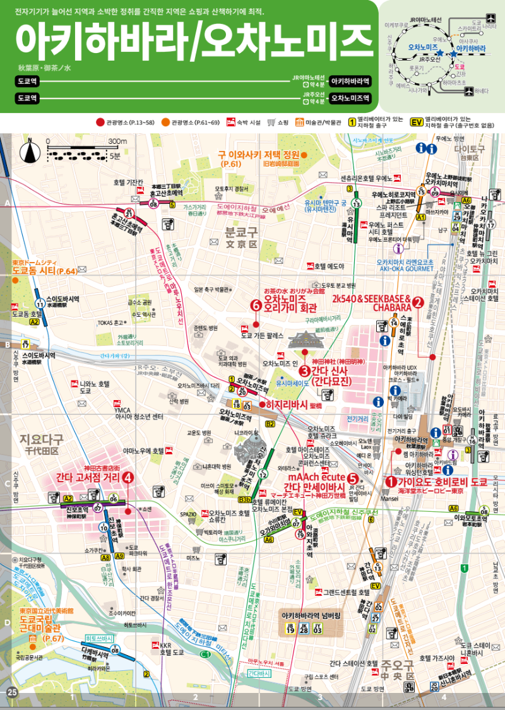

# 2024년 동경 가족 여행

>      2025년 1월 24일 (금) ~ 2월 1일 (토) 까지 

## ~ 1/22 (수) 여행의 시작

#### 12월 1일 (일)

* [숙소 예약 완료](https://kr.hotels.com/trips/72060039069774)
  * 1/24 ~ 1/27 : APA 호텔 아키하바라 에키키타
  * 1/27 ~ 2/1 : THE TOURIST 호텔 아키하바라

## 1/22 (수) ~ 1/23 (목) 여행 준비

#### 1월 23일 (목)

* 차량 완충해서 주차해 둘 것
* 관람 장소 사전 예약
* [스이카 카드 찾아둘 것](https://www.jreast.co.jp/multi/ko/pass/suica.html)
* [입국심사 및 패스트트랙 신청](https://services.digital.go.jp/ko/visit-japan-web/)
* [와이파이 도시락 신청](https://www.wifidosirak.com/v3/index.aspx) (1/24 ~ 2/1)
* 사고 싶은 게임 목록 일본어로 출력

#### 1월 24일 (금) 오전

* 10:00 인천공항 리무진타고 출발
* 15:05 인천국제공항 1터미널 - 에어부산 BX0166 - 17:50 도쿄 나리타 국제공항 1터미널

## 1/24 (금) ~ 1/27 (월) 3박 4일 : [APA 호텔 아키하바라 에키키타](https://maps.app.goo.gl/AbkY77GPASzE28NW7)

#### 1월 24일 (금) 저녁

* 아키바 주변 구경 거리
* 아키바 주변에서 저녁 식사

#### 1월 25일 (토)

* 

#### 1월 26일 (일)

## 1/27 (월) ~ 2/1 (토) 5박 6일 : [THE TOURIST 호텔 아키하바라](https://maps.app.goo.gl/FDwdE8iBMgEWP2Ci7)

#### 1월 27일 (월)

* 
* 

#### 1월 28일 (화)

#### 1월 29일 (수)

#### 1월 30일 (목)

#### 1월 31일 (금)

#### 2월 1일 (토)

* 11:10 나리타 국제공항 1터미널 - 에어부산 BX0163 - 14:00 인천국제공항 1터미널

#### 질문

* 항공권 관련
  * 자리 예약이 사전에 가능한지?
  * 수하물 용량이 얼마인지?
  * 사전 체크인이 가능한지?
* 숙소 관련
* 아키바 게임샵 오픈 시간
  * 대부분 10시~12시 사이에 오픈

#### 링크

* [diorian@인터파크](https://www.interpark.com/)
* [일본여행 공식 가이드](https://www.japan.travel/ko/kr/)
* [일본여행 준비물 체크리스트](https://www.kkday.com/ko/blog/22262/aisa-japan-entry)
* [아키바 3박 5일 여행기](https://cafe.naver.com/moopung/138008)
* [타베로그](https://tabelog.com/kr/)
* [도쿄여행 팸플릿](https://www.gotokyo.org/book/ko/genre/guidemap/)
* [아키하바라 맛집 추천](https://livejapan.com/ko/in-tokyo/in-pref-tokyo/in-akihabara/article-a0005429/)

#### 장소 & 맛집

* 사전 예약
  * 전망대 도쿄 스카이트리, 도쿄 타워 등
  * 교통 관련 코스 확인 및 할인
  * 팀랩 입장권 예약 및 구매
  * 지브리 박물관
* 소비세 10%
  * 면세를 고려한 구매
* 교통
  * 지하철은 길면 길수록 할인이 높아지는 도쿄서브웨이 티켓
  * JR 패스, 스이카, 파스모
* 숙소 주변 다코야끼, 돈까스 테이크아웃 찾을 것
  * 맥주와 안주
  * 편의점 과일 요거트
* 시부야 카부키초
  * 카무로초 용과 같이 사진 찍기
  * 미야시타 공원
* 신주쿠
  * LUSH 얼굴팩, 입욕제 (선물용)
  * 우동맛집 우동신, 사누키 우동
  * HARBS 과일 크레이프 - 일찍 안 가면 오링남
* 이케부쿠로
  * 여자 오타쿠의 성지
  * 대형 복합 쇼핑몰 선샤인시티
* 나카메구로
  * 메구로 강변 스타벅스 크림브릴레 라떼 먹어보기
* 키치조지
  * 나카미치도리 책 골목
  * 이노카시라 공원 벗꽃
  * 지브리미술관
* 니혼바시 긴자
  * 미츠코시 백화점 등 고급 백화점
  * 100년 노포
  * 긴자 치쿠요테이 장어덮밥
  * 긴자 기무라야 일본 최초 단팥빵
  * 긴자 이마카츠 닭가슴살
  * 긴자 문구점 이토야 12층 문구 덕후
  * 긴자 츠키지 시장 - **수/일요일 휴무 확인** [캘린더](https://www.tsukiji.or.jp/calendar/)
    * 
* 신바시 유라쿠초
  * 낮에는 빌딩숲 이지만 밤에는 요코초 꼬치구이 등의 선술집
* 도쿄
  * 스카이트리
  * 도쿄 타워
* 고쿄
  * 히가시 공원
  * 니쥬바시
* 오다이바
  * 유니콘 건담 - 11~17 2시간 간격, 19~21 30분 간격
  * 도요스 시장 - 유리카모메
  * 팀랩 보더리스 - 디지털 아트 뮤지엄
  * 해안공원 레인보우 브릿지
* 우에노
  * 공원, 동물원 및 박물관
  * 재례시장 아메요코초 상점가
* 아키하바라
  * 남자 오타쿠의 성지

### 지도

* 

* 