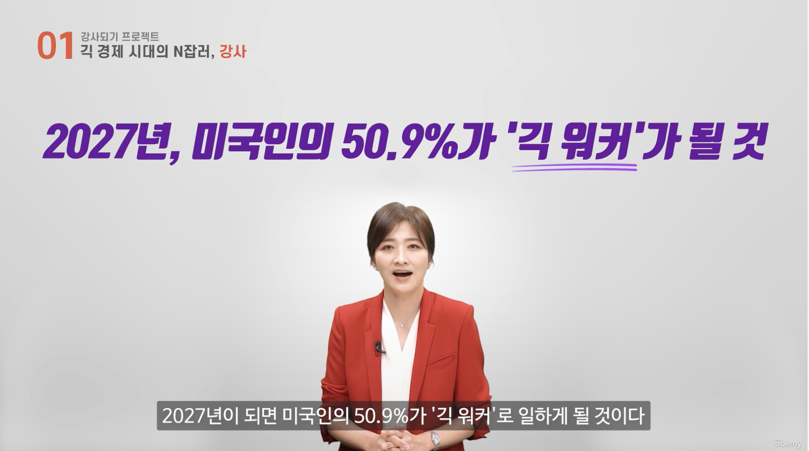
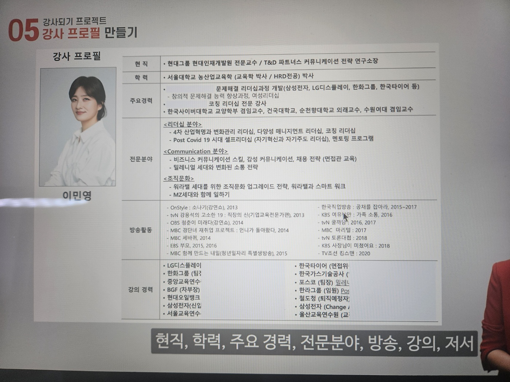
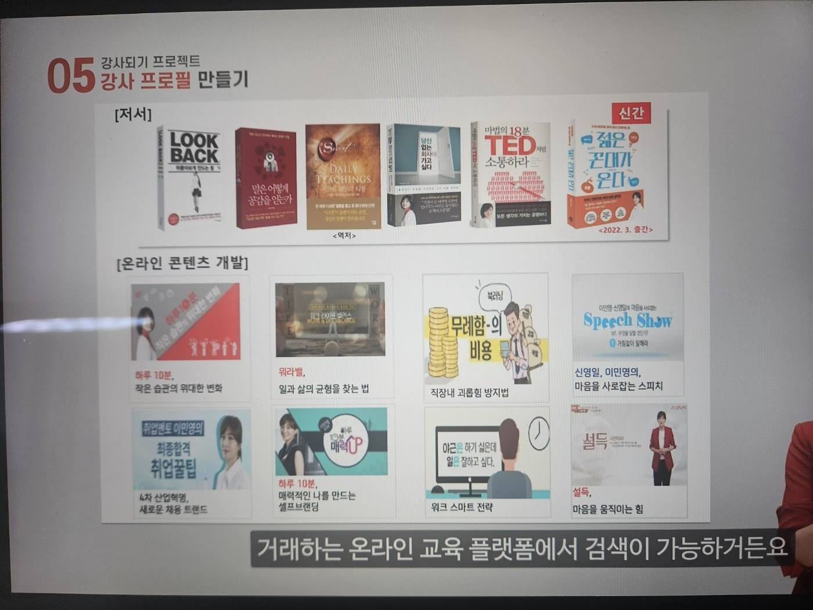
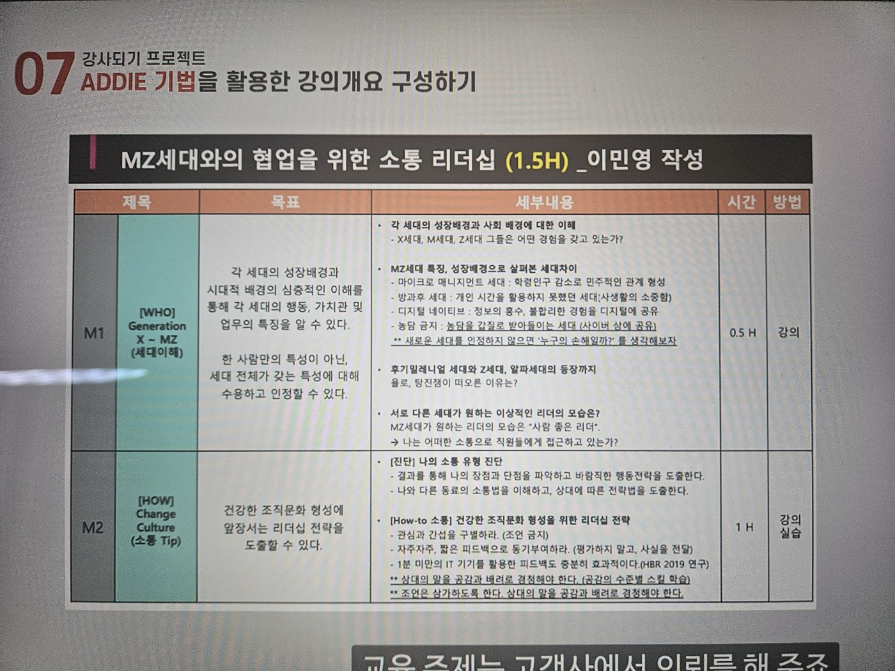

## 루틴: 2025년 6월 1일 (일)

>     

### 1. 경제 시대의 N잡러, 강사

#### 1.1 저상장이 뉴노멀이 된 시기에 자기계발이 트렌드

* 긱 경제 (Git Economy) : 프리랜서 혹은 가볍게 고용의 형태를 가지는 경제
  * 탤런트 뱅크, 크몽
  * 2027년 미국인의 50.9% 가 '긱 워커'가 될 것

* 

### 2 내가 가진 모든 이야기가 강의 주제가 될 수 있다

#### 개요

* **세상의 변화에 민감하고 기민하게 학습하는 것을 좋아해야 한**다
  * 면접관 교육, 소통, 여성 리더십, 세대 차이, 4차 산업 혁명 등의 트렌드에 따라 다르다
* **내가 가장 잘할 수 있는 것**을 해야한다
  * 새롭게 만들기 보다 내가 하고 있는 일을 먼저 한다
  * 말을 잘하는 기술에 집중하기 보다 내가 어떤 이야기를 할 수 있는가

#### 2.1 어디부터 시작하면 좋을까?

* 시작은 가까운데서 부터
  1. 나의 직업에서 찾기
  2. 나의 이야기
  3. 강사 자격 과정
  4. 전달력으로 승부

*  마이크로 러닝
  1. 짧은 단위의 콘텐츠로 간편하게 학습하는 형태
  2. 나의 콘텐츠를 평소에 잘 정리해 두어야 한다
  3. 실전 TIP - 엑셀, 파워포인트 등

#### 2.2 나의 이야기로 강의 콘텐츠 만들기

* 어떤 것들이 이야기가 되는가?
  * 여행을 가서 '나의 이야기'를 만들어갈 수도 있다
  * 이 경험을 통해서 내가 '배운 점'은 무엇인가?
* 나의 메인 컨텐츠가 있고 거기에서 곁가지고 확장하는 방향이 좋다

#### 2.3 강사 자격 과정을 활용하기

* 기업 내 필수 교육을 활용하는 경우
  * 성희롱, 폭력예방, MBTI 진단지 등

#### 2.4 전달력으로 승부하기

* 내가 뛰어난 전문가는 아니지만 **좀 더 좋은 전달력을 위한 노력**이 필요하다
  * 그래픽 레코딩 과정을 통해서 나의 자료를 업그레이드 하는 것
  * "대장금을 통해서 본 멘토링", "한 상궁의 코칭 스킬" 등

### 3. 자격증이 필요 없는 강사의 세계

* 자격증 대신 **자신만의 브랜드**를 가져야 한다
  * 판매사원 출신 강사 ㅇㅇㅇ
  * 자신만의 컨텐츠와 브랜드를 먼저 찾아보라
  * 이름을 먼저 지어놓고 그대로 살아가면 된다
  * SNS 에 꾸준하게 지속적으로 자신의 컨텐츠를 잘 해내는 것
* 열심히 살아가는 '나의 모습'을 담자
  * 그 어떤 스킬도 뛰어넘을 수 있다
* 내가 직접 경험한 지식을 잘 전달하는 것을 통해 나만의 브랜드를 만들 수 있다
  * 대규모 전환 작업 성공기
  * 팀 단위에서 마이크로 서비스 구축기
  * 대규모 장애 상황에서 대응하는 과정과 정상화 까지 극복 과정
  * 엔씨에서 데이터 엔지니어링 팀을 꾸리기 까지 경험담
* 내가 하는 말과 강사는 같은 행동을 해야 한다
  * 나는 어떤 닉네임 어떤 사람으로 불려지고 있는가?
  * 나는 어떤 컨텐츠와 브랜드를 만들어가고 있는가?

### 4. 강사는 얼마나 벌까?

* 회 당 수 만원에서 수 백만원까지 존재하며 해외에는 수 억까지 가기도 한다
  * 나의 강사료는 내가 정하는 것이 아니라 **시장이 정한**다
  * 다만 나의 **노력**이 반영된다
* 책을 쓰면서 특강을 하게 되었는데 강사료 점프가 되었다
  * 강의, <u>워크숍 (15~50만/시간)</u>, <u>특강 (100~300만/시간)</u>
  * 공공기관은 좀 더 낮을 수 있고, 컨설팅 기관을 통하면 수익이 나뉘어질 수 있다
    * 사기업에 주 1회 120만 * 4주 = 480만원
  * 학위나 경력 등에 따라 강의료가 달라진다
    * 김영란법 이후에 공공기관에는 강의료가 하위 평준화가 되었다
* 강의료 네고는 "**정해진 예산을 말씀해 주세요**" 정도로 시작하자
  * 짧은 강의여도 특강이 아니고 일반 강의인 경우가 많아서 <u>강사료는 주시는 대로 받겠</u>습니다
  * 단, **강의료의 하한선은 정해두고 있는 것**이 좋습니다
  * 강사료 때문에 강의를 거절한다면 점점 강의할 장소가 없어질 수 있다
* 온라인 강의의 경우
  * 강사료만 받는 경우
  * 수익을 쉐어하는 경우 (유데미)

### 5. 강사 프로필 만들기

* 강사로 등록하고 브랜딩을 위해서는 강사 프로필을 만들어아 한다 

  * 

  * 온라인 컨텐츠에 대한 소개도 있으면 추가하면 좋다
    * 

* 가장 중요한 것은 사진이다

  * 누가 봐도 매력적으로 프로답게 **너무 오래된 사진 보다는 몇 년 주기로 새로 촬영**할 것
  * 비용이 들더라도 제대로된 사진관에서 찍고, 해상도 높은 것도 파일로 같고 있어야 현수막 혹은 광고지 같은 큰 화면으로도 활용될 수 있기 때문이다
  * 기업 혹은 공공기관에 따라서 여러가지 종류의 분위기에 따른 사진이 필요하다
  * 예쁘다가 아니라 누가 봐도 **강사라는 느낌이 드는 성의**가 있어야 한다
  * 매 **강의 주제와 맞도록 강사 프로필을 수정**해서 전달하는 것이 효과적이다

* 강사 카드 예시

  * 강사용 vs. 수강생용 별도의 자료를 제공하여 긴장감과 집중력을 유지
  * 새로운 원고인 경우에만 원고료를 지급하는 기준이 있다 (최소 30% 이상 수정)

* 나의 경력을 작성해보기

  * 파워포인트에 나의 경력을 찬찬히 나열하기

### 6. 나만의 콘텐츠 찾기

* <u>컨텐츠를 가지기 위한 좋은 습관</u> 가지기
  * **매일 매일 일어나는 일을 글**로 남겨라
  * **어떤 이야기가 강의가 될 지 매일 생각**해라

### 7. ADDIE 기법을 활용한 강의 개요 구성하기

* ADDIE 기법을 활용한 강의개요
  * 
  * 
* 교수설계기법 ADDIE
  * A : analysis 분석 - 고객이 무엇을 원하는 지 분석
  * D : design 설계 - 전체적으로 어떻게 진행할 것인지 설계
  * D : develop 개발 - 실제 교육 내용을 개발하여
  * U : implement 적용 - 강의에 적용하고
  * E : evaluate 평가 - 강의 결과를 평가하고
  * 

#### 7.1 분석

* 교육과 관련한 모든 사항을 분석
  * **교육의뢰 고객사의 담당자를 통한 분석이 가장 중요**하다
* 교육 대상자에게 필요에 따라 직원 대상 설문조사도 한다
* 조직내 교육과 관련한 다양한 교육 경험 분석
  * 유사한 교육이 있었는지 여부
* 강의의뢰서가 있는 경우도 있다
  * 비대면 총 O시간 교육 - 지루할 수 있으므로 활동 할 수 있는 액티비티를 넣어야 한다
  * 대상자 특징, 연령 및 회사의 역사에 대한 것도 아주 중요합니다
* 교육은 만들지 않고 **설계**한다 <엑셀에서 설계>
  * 책의 목차와 같이 강의주제, 목차, 실습 및 활동 등에 대한 준비를 엑셀에서 한다
  * 해결하고자 하는 목표와 접근 과정 및 솔루션 제시까지 스토리보드를 작성한다
  * 강의 준비 시에 목차 별로 세부내용과 참고 자료 등을 사전에 준비한다
* 어떤 내용을 구체적으로 채울 것인가를 고민하는 단계 <프리젠테이션 작성>
* 샘플 강의안을 보여주거나, 테스트로 진행해 보는 것 <테스트 실행>
* 테스트로 받은 피드백을 기반으로 반영한 내역을 실제 강에서 진행 <평가 및 피드백>
  * 좋은 것은 더 강조하고, 나빴던 부분은 개선하면 된다
* "이번 강의는 어떠했어~" 와 같은 **자기평가**
  * 타인의 평가가 없더라도 '자기평가'를 통해서 일기처럼 작성해 둔다

* 강의개요 작성 방법
  * 교육 주제는 고객사에서 의뢰를 주기 때문에 그에 따라 작성하지만 교육 제목이나 교과목은 매력적이고 교육 목적과 잘 부합되어야 합니다
    * 단어 혹은 짧은 문장이 아니라 "~를 통해서 ~를 할 수 있다"와 같은 표현이 필요하다
    * "듣고, 말하라" 와 같은 제목도 매력적이다
    * "4차 산업시대에 요구되는 소통 역량" 과 같이 시대를 반영한 느낌\

### 8. 기억에 남는 강연, 스토리로 말하라

* 세부내용 작성 방법 - "**감동**" + "**기억**"
  * 강연에서 본론에 해당하는 가장 중요한 것은 "**스토리로 말하라**"
  * 동화가 얘기하는 "착하게 살아야 해" 와 같이 동화가 전달하는 메시지가 기억에 남는다
  * 기억에 잘 남는 것은 남에게 전달하기 쉽도록 "구전이 가능한" 감동 스토리를 만들어라
* 나의 이야기를 지속적으로 만들고 얘기할 수 있는 것이 기억에 남기기 위함이다
  * 기술만 전달해야 하는 강의는 팩트만 전달할 수도 있다
  * 다만, **팩트를 전달할 때에도 감정을 전달해야만 좀 더 오래 잘 기억된다**
* <u>오래 기억남는 이야기</u>는 어떻게 구성할 수 있을까?
  1. 내 이야기 - 내가 경험한 실패한 혹은 성공한 나의 리더십 이야기, 상사 혹은 나의 이야기
  2. 남의 이야기 - 유명인들의 이야기를 잘 찾아봐서 (CEO, 위인 등) 
  3. 통계나 연구결과 - 
* **스토리+객관적인 연구 결과**를 가미했을 떄에 교육의 효과가 배가된다
  * 회사 다닐 때의 이야기 (퇴근 못하게 했더) + 아는 지인의 회사 이야기 + "행복한 직원은 판매실적이 37% 높고, 창의성은 3배 높게 나타났다" - 하버드 비즈니스 리뷰 (HBR) 연구 결과
  * 앞서서 전달한 이야기가 더 힘을 받게 된다 ... 일을 푸시해서 더 잘할 수 있는 게 아니라 행복하게 해주어야 된다는 것이다
  * "아 ... 앞에서 그래서 저런 이야기를 했구나" 라고 느낄 수 있어야 한다

* 이론, 통계, 연구의 기반인 "**강사 마인드**"
  * 책, 뉴스 등의 매 순간 자료 스크랩을 하는 것
  * 잡 코리아 등등의 서베이 결과가 있는데 "**숫자로 된 연구 결과**"는 논리적인 강의로 만든다
  * 서점에서 **강의에 활용하기에 좋은 책**들을 잘 점찍어 두어라 (단 최신 출판 버전, 출처 언급)
  * 서적이나 논문을 활용하면 신뢰도가 올라가므로 **통계청**, **교육부** 자료를 활용하면 좋다
* <u>주변 사람의 충고나 이야기</u>는 나의 강의 스토리가 될 수 있다
  * 아르바이트 != 돈 인 사람과 어떤 일이든 진심인 사람
  * 통계나 논문도 좋지만 주변 친구와 동료의 얘기는 정말 좋은 스토리다
  * 동기부여, 자존감, 직업의 가치 등에 대한 
  * 영상으로 남는 강의는 항상 참고 혹은 사용해야 하는 유명인 혹은 실명을 쓸 때는 조심해야 한다. 왜냐하면 언제 구설수에 오르거나 문제가 될 수도 있기 때문에 항상 기사나 뉴스를 살펴보고 해당 청중에게 직접 물어보는 것도 좋은 방법이다
  * <u>스토리만 있다면 수다</u>처럼 들릴 수 있으므로, **이론이나 통계자료를 적절히 활용**하라

### 9. PPT 강의안 만들기, 스크립트 제작

* 철저하게 강의안은 보조자료이며 모든 **강의 내용은 머릿속**에 있어야 합니다
  * 프리젠테이션은 포인트가 될만한 몇 장만 사용하기를 추천합니다
* 강의 자료 준비 철칙
  1. 심플하게 - **K**eep **I**t **S**imple and **S**hort
  2. 커스터마이징하라 - 회사 청중에 맞게 변경
  3. 전문가의 도움을 받아라

#### 9.1 심플하게

* KISS 법칙을 지키는 프리젠테이션
  * 글씨가 많거나 조잡하면 청중의 시선이 나에게 오지 않는다
* 파워포인트의 배경은 템플릿을 쓰지마라
  * 사람들 눈에 익숙한 배경은 집중력을 떨어뜨린다
  * 깨끗한 화면에 그림 하나만 띄워 놓는 게 오히려 이미지가 남아서 효과적이다
  * 저작권 없이 사용할 수 있는 그림만 사용하라

#### 9.2 커스터마이징 하라

* 회사의 이름 혹은 청중에 맞게 반드시 수정해야 한다
  * 고객사 홈페이지에서 **CI 및 RGB** 값 확인할 것
  * 해당 조직에서 원하는 글꼴을 활용하는 경우도 있다
  * 가능하면 기본 글꼴을 활용하는 것이 가장 좋다 - 누락된 경우 깨진다
* **1장에 약 5분**, 1 시간에 10장 정도면 충분한 분량이다

#### 9.3 전문가의 도움을 받아라

* 강의자는 본질에 집중해야 한다
  * 너무 어설프거나 프로답지 않은 장표는 강의의 질을 떨어뜨린다

#### 9.4 스크립트 작성

* 내가 강연장에 가서 하는 말을 그대로 한 번 적어보기
  * **연극의 대본**을 쓰는 것 처럼 "인사말, 농담, 마무리" 작성한다
  * 참고할 만한 강사의 모든 말을 **녹음에서 그대로 따라하는** 연습
* 휴대용 **녹음기를 통해서 직접 녹음하고 계속 들으면서 외웁니다**
  * 대본작업을 하지 않으면 내가 준비한 자료를 모두 전달하지 못한다
  * 프롬프트를 보고 읽는 것도 모두 외우고 있기 때문에 자연스럽다
* 강의 자료의 분량은 어떻게 준비하면 되는가?
  * 직접 테스트하고 연습하여 준비한다
  * A4 1장은 대략 5분 내외로 나오므로 10분짜리 컨텐츠는 ? 2장

### 10. 강의하기 실전, 무대에서 어떻게 움직일 것인가?

#### 10.1 이미지 트레이닝

* 강의 시작 보다 일찍 도착합니다
* 노트북과 빔을 연결합니다
* 강의장에 먼저 앉아서 기다립니다
* 담당자가 소개 합니다 (없는 경우도 있습니다) 
* 이 때 나는 일어서서 청중을 바라보면서 있습니다
  * 시간 되면 내가 알아서 시작 할게요
* 정중하게 90도 인사를 하고 아주 밝게 웃습니다
  * 강의장의 모든 청중이 나의 미소를 바라보고 웃습니다
* 교탁 앞으로 나와서 좀 더 청중과 가까이 갑니다
  * 교탁 뒤에 서 있으면 내가 작아보입니다
  * 몸이 다 들어나게 슬라이드를 바라보지 않습니다
  * 무대 가운데를 잘 활용합니다
* 나의 손에 마이크와 포인트를 갖고 있습니다
  * 왼손에 마이크, 오른손에 포인터를 듭니다
  * 마이크는 얼굴이 다 보이게 전체 소리가 골고루 인식되도록 합니다
  * 마이크의 대를 잡되 모든 손으로 감싸서 누가봐도 안정감 있게 잡습니다
  * 포인터는 보지 않고 동작해도 실수 없도록 나의 것을 들고 다닙니다
  * 하나는 원거리용, 일반 강의장 두 가지 포인터를 들고 다닙니다 (예쁘고 좋은 것 사세요)
* 강의안을 넘기면서 강의를 시작합니다
  * 강의안에 너무 의존하지 말고 머릿속에 모든 내용이 다 있습니다
  * 강의안을 넘길 때에 외우고 있을 때 강사의 프로성이 드러납니다
  * 넘기면서 다음 자료를 설명할 수 있습니다
  * 태블릿에 내가 준비한 강의안을 넣어두고 앞에 두고 미리 볼 수 있습니다
* 태블릿을 들고 보면서 사전에 준비를 할 수 있습니다
  * 살짝 살짝 요령 껏 봐야 티가 안 납니다
* 빨리 마쳐달라고 요청할 때에는 어떻할까?
  * 미리 준비한 테블릿이 있다면 ... 34번 슬라이드라면?
  * 34 + 엔터로 바로 이동하여 슬라이드를 넘기는 상황을 피할 수 있다
  * 누군가가 질문할 때에도 12 + 엔터로 가는 방법도 있습니다
  * 강의 순서를 정하기 위해서 큐카드를 작성해두는 것도 좋습니다
* **시선의 기본은 교육생으로 가야**합니다
  * 강의안을 쳐다보는 것이 가장 최악의 태도
  * 강의 내용이 없더라도 강의안을 보는 사람은 자신감 부족이다
  * <u>강의 내용을 설명하는 경우라도 시선은 청중을 바라봐</u>야 합니다
  * 포인터는 슬라이드를 향하고 강사는 청중을 향합니다
  * 손을 쓰는 경우 손등이 보이지 않고 손 바닥이 보이도록 합니다
  * 포인터는 돌리지 않고 찍는 것이 포인트입니다
  * 포인터가 강의장 화면에 적용이 되는지도 사전에 확인해 보아야 합니다
* 강의가 끝나고 90도로 인사하고 웃으면서 강의를 마무리 합니다
  * 시각적인 요소가 가장 중요한 (55%) 요소다
  * 먼저 경험한 사람의 경험을 간접 경험하고
  * 연습도 기회가 될 때마다 하는 것을 추천합니다
* 빔과 프리젠티에션, 마이크 및 리모콘 모두 잘 정리하고 나옵니다
  * 컵과 내가 썼던 모든 물건은 깔끔하게 정리하고 나옵니다

### 11. 발음보다 개성 있는 억양

### 21. 회고

* **나의 회사 생활 하루 하루가 강의를 위한 스토리**가 될 수 있다
  * 실수와 성공 사례 모두 좋은 기회가 될 수 있다
  * 이번 사례를 통해서 어떤 것을 느끼고, 어떤 것들을 배웠는가?
  * 매일 매일이 나의 경력이고, 스토리다
* **나만의 데이터 엔지니어링 브랜드**를 구축합니다
  * 그래픽 레코딩 기법을 매일 매일 연습해보자
  * 새로운 분야에 새로운 시도를 하는 것
* **수시로 팀 내에서 기술 공유에 짧은 공유**를 한다
  * 짧고 핵심적인 요소를 어설프지 않고 프로답게 준비하고 진행한다
  * 매일 매일 정보를 정리하고, 일 주일에 한 번 요약하여 정리합니다
  * 자료 준비, 정리, 설계 및 억양에 이르기까지 강의를 연습합니다
* 데이터 엔지니어링 **팀장으로써 해야 할 가장 중요한 일**이 뭔가?
  * 우리의 기술 기반을 잘 정리하고 요약한다
  * 내가 얻은 인사이트를 팀 내에 효과적으로 전달한다
* GPT 물어보면 되는데 왜 내 강의를 들어야 하는가?
  * 나의 지식이 나눌만한 가치가 있는가?
  * 나 스스로가 계속 학습하고 있는가?
* 공개된 플랫폼이 많지 않은가?
  * 유데미, 클래스101
* 잘 전달해주고 설명해주는 강의가 많지 않은가?
* 부업으로 한 달에 200을 벌 수 있는 일이 뭐가 있을까?
* 한 달에 얼마의 수익이 발생하면 회사를 그만둘 수 있는가?
* 5일동안 필요한 강의인가?
  * 워크숍 중심의 교육생 토의, 실습 발표 등에 따라 달라지고
  * 강사가 퍼실리테이터 역할로 구성될 수도 있다
* 
