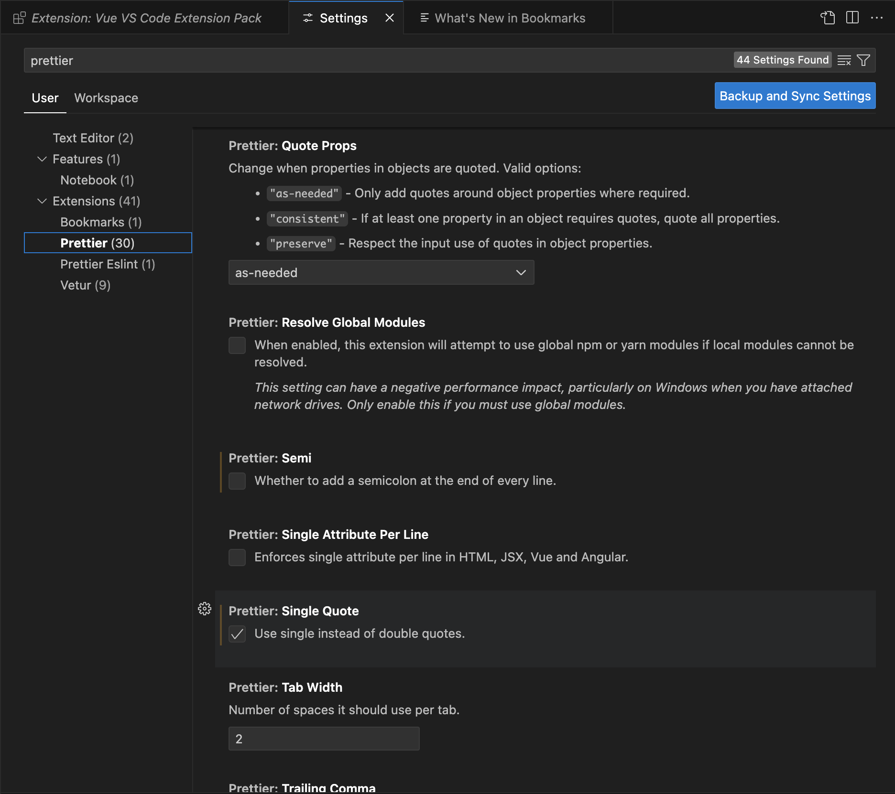

## 루틴: 2025년 11월 29일 (토)

>     

### 오늘의 작업 이력

#### 설치 및 초기 환경 구성

* `VS Code` 최신 버전 설치 후 아래의 패키지를 설치 및 설정한다

  * `Vue VS Code Extension Pack` : 개발에 필요한 다양한 플러그인 꾸러미
  * `Codex – OpenAI’s coding agent` : 질문과 답변 뿐만 아니라 코드 스니펫 제공 및 수정까지 지원해주는 끝내주는 에이전트

* `Prettier` 설정

  * 

* `Node.js` [Node 설치](https://nodejs.org/ko/download)

  * ```bash
    # nvm 다운로드 및 설치:
    curl -o- https://raw.githubusercontent.com/nvm-sh/nvm/v0.40.1/install.sh | bash
    
    # Node.js 다운로드 및 설치:
    nvm install 24
    
    # Node.js 버전 확인:
    node -v # "v24.11.1"가 출력되어야 합니다.
    nvm current # "v24.11.1"가 출력되어야 합니다.
    
    # Verify the Node.js version:
    node -v # Should print "v24.11.1".
    
    npm 버전 확인:
    npm -v # 11.6.2가 출력되어야 합니다.
    ```

  * nvm 설치는 파이썬 VirtualEnv 와 유사하게 별도 환경을 구성해서 설치하는 방식이라고 함

  * node 설치 후 node 패키지 관리자인 npm 버전을 확인한다

* `Vue.js devtools` 크롬 플러그인 설치

* `Bootstrap 5` 설치

  * CSS/JS UI 프레임워크
  * 글로벌 설치는 권장되지 않으며 프로젝트 경로에서 `npm install bootstrap` 통해서 설치

* `Vite` 구성 및 설치

  * 별도의 번들 없이 `ES Module` 을 웹 브라우저에 렌더링 (HMR Hot Module Replacement) 할 수 있도록 만든 툴

  * 빌드 속도 매우 빠른 차세대 개발도구이며 Vue/React/TS와 완벽 호환하고 Webpack보다 훨씬 가볍고 설정도 쉬움

  * ```bash
    npm create vue@latest # 마지막에 . 과 같이 경로를 추가하면 해당 경로에 구성을 할 수 있음
    npm init vite@latest
    npm install # 위 명령으로 구성을 완료 후 마지막에 반드시 설치해야 함
    ```

* 실행 및 빌드

  * ```bash
    npm run dev # package.json 파일에 포함된 scripts 내의 설정을 참조하여 실행
    npm run build # 마찬가지로 번들링 하는 작업을 dist 경로 내에서 수행하게 됨
    npm run preview # 번들링한 dist 경로 기준으로 웹 서버를 띄워서 실행
    npx http-server dist -p 3000 -c-1 # 이미 http-server 설치가 되어 있다면 특정 포트에 실행도 가능함
    ```

  * 번들링 작업이란?

    * ✔ TypeScript → JS 변환
    * ✔ Vue SFC(.vue 파일) → JS 변환
    * ✔ CSS 모듈 → 병합 및 압축
    * ✔ 이미지/정적 파일 → 해시 붙이고 최적화
    * ✔ 전체 프로젝트 → `dist/` 폴더에 결과물 생성

* 메인 프로그램 생성

  * ```bash
    index.html # 가장 첫 번째 엔트리포인트 즉 메인 함수나 마찬가지 <script src=main.js/>
    main.js # 앱을 실행시키는 첫 번째 스크립트이며 vue 컴포넌트를 import Vue from App.vue
    App.vue # 화면을 구성하는 최상위 컴포넌트
    ```

  * 참고로 Pinia 는 **Vue 공식 상태 관리 라이브러리**로,  Vuex의 후속작이자 **Vue 3에서 가장 권장되는 상태관리 방식**이자 공통 저장소 역할임

    * state / actions / getters 역할을 제대로 이해해야 함

  * `App.vue` 는 `scripts` `template` 그리고 `sylte` 3가지 요소로 구성된 `SFC (Single File Component)` 다

    * `scripts` :  스크립트를 선언 및 구현할 수 있는 영역
    * `template` : HTML 기반의 DOM 구성을 하는 영역
    * `style` : CSS 스타일 코드를 구성하는 영역

  * 개발 과정에서 자꾸 구문 오류가 나는 이유는 `eslint` 설정이 되지 않았기 때문

  * ```bash
    npm install eslint eslint-plugin-vue --save-dev
    npx eslint --init
    ```

    * Vetur는 Vue 2 전용이며,  Vue 3에서는 Volar 사용이 공식 권장(사실상 필수)
    *  `settings.json` 파일에서도 `vetur` 관련 설정은 모두 제거 및 `Vitur plugin` 또한 disable

  * 


#### 이력

* 00:00 ~ 01:00 

#### 회고

* 

### 학습 영상 청취

> 학습 관련 영상 링크와 내용 요약

### 정보 수집 및 요약

>   게임 월드의 흐름을 이해하고, 어떤 것들이 가장 큰 이슈이고, 앞으로 어떻게 변화할 것인지를 알 수 있도록 매일 조금씩 조금씩 탐색하고, 고찰해야 한다

### 뷰트랩 영상 분석

>    어제 찾아둔 영상리뷰 탭의 영상을 빠르게 리뷰하고, 어떤 인사이트가 있는지, 왜 이 영상이 좋은지, 그리고 댓글을 통해서 시청자의 요구사항을 발굴하고 분석한다

### 금주 미드폼 작성

>  사람들은 어디서 공감을 하고, 대리만족을 느끼는가? 내가 하는 분야에 있어서 어떤 부분이 대리만족일 수 있는가? 외에도 교육용 혹은 실버 세대를 위한 노트북 혹은 아이템 판매 리뷰

### 숏폼 공장 돌리기

>     매주 토요일 오전부터 하루 종일 쇼츠 5~7편 만들기 위해 설계를 한다. 주어진 템플릿에 해당하는 주제들을 스크리닝 하고, 동일한 포맷으로 틀을 만든다. 그리고 생산성을 높이기 위해 기본정보 수집, 게임 정보, 동영상 녹화 등 수평적으로 매 단계를 진행하여 최종 더빙 전까지 모든 작업을 동시에 진행한다

#### 쇼츠 카테고리

* "게임용어 #탄"
  * 
* "#월 할인게임"
  * 선정기준
    * 메타 80점 혹은 유저 8점 이상 반올림
    * 스탠다드 기준 실구매가 2만원 이하
    * PS+ 스페셜 무료 게임 제외, PS+ 할인 미적용
    * PS5 버전이 있다면 PS5 기준
  * 게임 제목
    * 기본정보
      * 제작사, 유통사, 장르, 출시일, 한국어 지원, 연령, 1인, 싱글/멀티
      * 플랫폼 0 원 (0% 할인)
      * 메타 1.0 유저 1.0
      * 1월 1일 (월) 프로모션 종료
    * 특이사항
    * 프롤로그
    * 게임소개
    * 개인의견
    * 스크립트
* "#월 할인종료"
  * 
* "#월 발매예정"
  * 

#### 편집 시에 유의할 점

* 쇼츠의 경우 하단에 제목이 표시되므로, 자막의 위치를 보여지도록 올리고, 상단의 타이틀도 전체 비율에 맞게 조금 내릴 것
  * 세로 화면에서도 보이도록 전체적으로 글자 폰트를 1.2~1.5배 정도 키울 것
* 미드폼의 경우 하단에 플레이 도구가 있기 때문에, 상시 나오는 자막과 수시로 보이는 자막의 위치가 항상 일정하도록 구성할 것
* 더빙된 음성과 백그라운드 음악에 섞여 음성이 잘 안들리는 경우가 많으므로, 기본 믹서는 그대로 두고 개별 음성의 볼륨을 인스펙터에서 조정할 것
  * 음성 : 믹서에서 최대로 올리고
  * 배경 : -15 정도로 볼륨을 개별 적으로 줄인다 

#### 더빙 시에 유의할 점

* 대본을 읽지 말고, 평소에 말하는 것 처럼 파 이상 톤으로 말할 것
* 말 끝을 흐리지 말고 또박 또박 말할 것
* 나의 미래는 밝고, 게임을 통해 행복해질 수 있다는 느낌을 가질 것

#### 썸네일과 제목 작성시 유의할 점

* 썸네일과 제목의 방향성을 명확히 할 것
* 제목은 검색에 효과적인 범위가 큰 추상화된 키워드를 사용하고
* 썸네일에는 글로 작성하기 어렵지만 우리가 전달하고자 하는 구체적인 키워드를 사용하라
